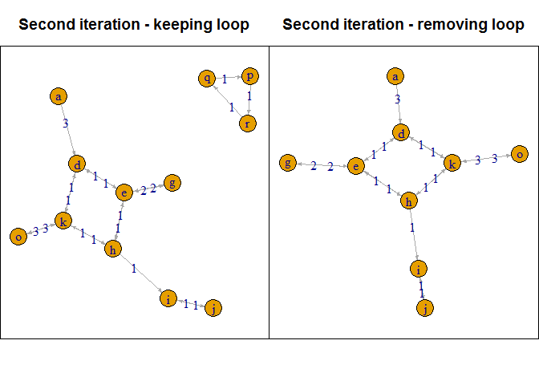
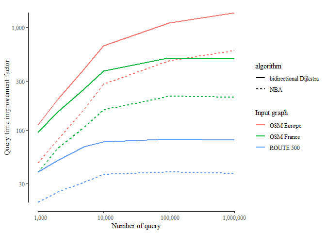
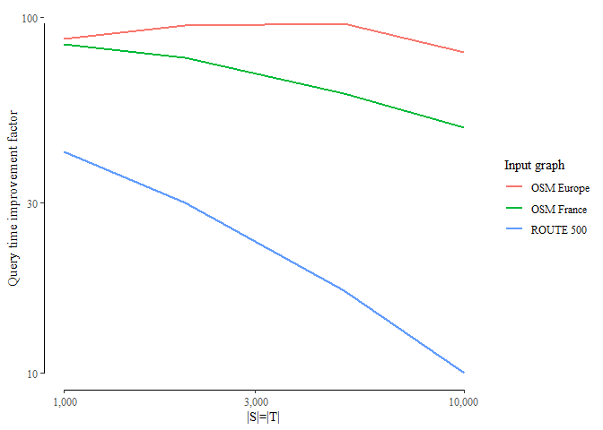
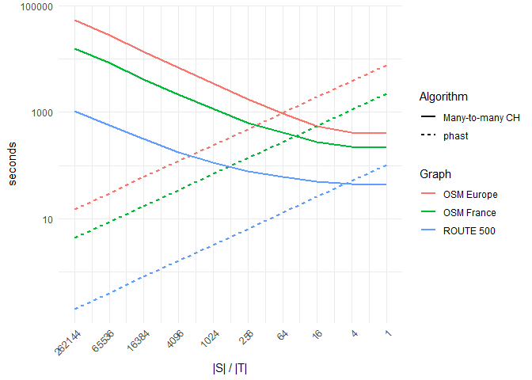
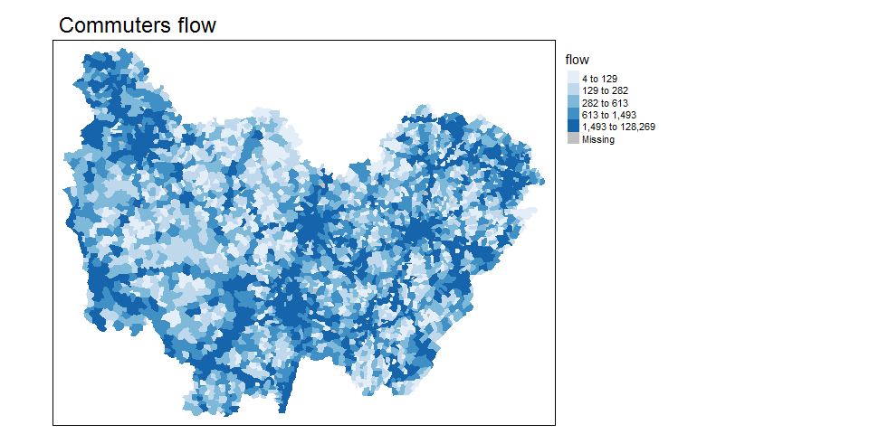

cppRouting package v2.0
================
Vincent LARMET
December 12, 2019

-   [Package presentation](#package-presentation)
-   [Install](#install)
    -   [Stable version from CRAN](#stable-version-from-cran)
    -   [or from github](#or-from-github)
-   [Data](#data)
-   [Main functions](#main-functions)
    -   [Path algorithms](#path-algorithms)
    -   [Examples](#examples)
        -   [Prepare data](#prepare-data)
        -   [Instantiate the graph](#instantiate-the-graph)
        -   [Distances by pairs between nodes (*one-to-one*)](#distances-by-pairs-between-nodes-one-to-one)
        -   [Compute possible detours within a fixed additional cost](#compute-possible-detours-within-a-fixed-additional-cost)
        -   [Graph simplification](#graph-simplification)
        -   [Contraction hierarchies](#contraction-hierarchies)
        -   [Compute isochrones](#compute-isochrones)
-   [Applications](#applications)
    -   [Application 1 : Calculate Two Step Floating Catchment Areas (2SFCA) of general practitioners in France](#application-1-calculate-two-step-floating-catchment-areas-2sfca-of-general-practitioners-in-france)
    -   [Application 2 : Calculate the minimum travel time to the closest maternity ward in France](#application-2-calculate-the-minimum-travel-time-to-the-closest-maternity-ward-in-france)
    -   [Application 3 : Calculate average commuting time to go to job in France](#application-3-calculate-average-commuting-time-to-go-to-job-in-france)
    -   [Application 4 : Calculate the flow of people crossing each municipality in the context of commuting in Bourgogne-Franche-Comte region](#application-4-calculate-the-flow-of-people-crossing-each-municipality-in-the-context-of-commuting-in-bourgogne-franche-comte-region)
-   [Benchmark with other R packages](#benchmark-with-other-r-packages)
-   [Citation](#citation)

Package presentation
====================

`cppRouting` is an `R` package which provide functions to calculate distances, shortest paths and isochrones/isodistances on non-negative weighted graphs.
`cppRouting` is characterized by :

-   its ability to work on large road graphs (country/continent scale)
-   its large choice of `one-to-one` shortest path algorithms
-   its implementation of **contraction hierarchies** algorithm

`cppRouting` is therefore particularly adapted for geographer, or whoever who need to calculate accessibility indicators at large scale.
Most of the functions are written in C++ and use std::priority\_queue container from the Standard Template Library.
This package have been made with `Rcpp` and `RcppParallel` packages.

Install
=======

### Stable version from CRAN

``` r
install.packages("cppRouting")
```

### or from github

``` r
library(devtools)
devtools::install_github("vlarmet/cppRouting")
```

Data
====

**This README file and all time measurements were made on a Windows 7 laptop, with i7 (4 cores) processor and 16GB of memory. **
The data presented here is the official french road network describing over 500000 km of roads.
All data used in this README are free and can be downloaded here :

-   roads : <http://professionnels.ign.fr/route500>
-   general practitioners location : <https://www.insee.fr/fr/statistiques/3568614?sommaire=3568656#consulter>
-   maternity wards location : <https://www.insee.fr/fr/statistiques/3568611?sommaire=3568656#dictionnaire>
-   shapefile of the ~36000 communes in France : <http://professionnels.ign.fr/adminexpress>
-   commuting to work from the French national census : <https://www.insee.fr/fr/statistiques/3566477#consulter>

Graph data have been preprocessed for more readability (see data\_preparation.R).

The final graph is composed of 234615 nodes and 685118 edges.
Data has to be a 3 columns data.frame or matrix containing from, to and a cost/distance column. Here the cost is the time needed to travel in each edges (in minutes). From and to are vertices IDs (character or numeric).

Main functions
==============

`cppRouting` package provide these functions :

-   `get_distance_matrix` : compute distance matrix (between all combinations origin-destination nodes - *one-to-many*),
-   `get_distance_pair` : compute distances between origin and destination by pair (*one-to-one*),
-   `get_path_pair` : compute shortest paths between origin and destination by pair (*one-to-one*),
-   `get_multi_paths` : compute shortest paths between all origin nodes and all destination nodes (*one-to-many*),
-   `get_isochrone` : compute isochrones/isodistances with one or multiple breaks.
-   `get_detour` : return nodes that are reachable within a fixed additional cost around shortest paths. This function can be useful in producing accessibility indicators.
-   `cpp_simplify` : remove non-intersection nodes, duplicated edges and isolated loops in the graph. Graph topology is preserved so distance calculation is faster and remains true. This function can be applied to very large graphs (several millions of nodes).
-   `cpp_contract` : contract the graph by applying **contraction hierarchies** algorithm.

### Path algorithms

Path algorithms proposed by the package are :

-   **1** uni-directional Dijkstra algorithm,
-   **2** bi-directional Dijkstra algorithm,
-   **3** uni-directional A\* algorithm
-   **4** New bi-directional A\* algorithm (Piljs & Post, 2009 : see <http://repub.eur.nl/pub/16100/ei2009-10.pdf>)
-   **5** *one-to-one* bi-directional Dijkstra adapted to contraction hierarchies (Geisberger & al., 2008)
-   **6** *many-to-many* bi-directional Dijkstra adapted to contraction hierarchies (Geisberger & al., 2008)
-   **7** PHAST algorithm (Hardware-accelerated shortest path trees), *one-to-all* algorithm adapted to contraction hierarchies (Delling & al., 2011)

*1*, *2*, *3* and *4* are available for **one-to-one** calculation in `get_distance_pair` and `get_path_pair` functions on a **non-contracted** graph. In these functions, uni-directional Dijkstra algorithm is stopped when the destination node is reached.
`A*` and `NBA*` are relevant if geographic coordinates of all nodes are provided. Note that coordinates should be expressed in a **projection system**.
To be accurate and efficient, `A*` and `NBA*` algorithms should use an admissible heuristic function (here the Euclidean distance), i.e cost and heuristic function must be expressed in the same unit.
In `cppRouting`, heuristic function `h` for a node (n) is defined such that :
**h(n,d) = ED(n,d) / k** with *h* the heuristic, *ED* the Euclidean distance, *d* the destination node and a constant *k*.
So in the case where coordinates are expressed in meters and cost is expressed in time, *k* is the maximum speed allowed on the road. By default, constant is 1 and is designed for graphs with cost expressed in the same unit than coordinates (for example in meters).
If coordinates cannot be provided, bi-directional Dijkstra algorithm is the best option in terms of performance.

*5* is used for **one-to-one** calculation in `get_distance_pair` and `get_path_pair` functions on a **contracted** graph.

*1* is used for **one-to-many** calculation in `get_distance_matrix` function on a **non-contracted** graph.

*6* and *7* are available for **one-to-many** calculation in `get_distance_matrix` function on a **contracted** graph.

Examples
--------

### Prepare data

``` r
library(cppRouting)
library(dplyr)
library(sf)
library(ggplot2)
library(concaveman)
library(ggmap)
library(tmap)
library(microbenchmark)
library(reshape2)

#Reading french road data
roads<-read.csv("roads.csv",colClasses = c("character","character","numeric"))
#Shapefile data of communes (polygons)
com<-read_sf("com_simplified_geom.shp")
#Correspondance file between communes and nodes in the graph (nearest node to each commune centroid)
ndcom<-read.csv("node_commune.csv",colClasses = c("character","character","numeric"))
#General practitioners locations
med<-read.csv("doctor.csv",colClasses = c("character","numeric","character","numeric"))
#Import materinty ward locations
maternity<-read.csv("maternity.csv",colClasses = c("character","numeric"))
#Commuting data from national census
load("commuting.Rds")
#Import nodes coordinates (projected in EPSG : 2154)
coord<-read.csv("coordinates.csv",colClasses = c("character","numeric","numeric"))
```

#### Head of road network data

``` r
head(roads)
```

    ##   from     to    weight
    ## 1    0 224073 0.4028571
    ## 2    1  65036 3.5280000
    ## 3    2 173723 1.8480000
    ## 4    3      2 2.5440000
    ## 5    4 113129 4.9680000
    ## 6    5      4 1.6680000

#### Head of coordinates data

``` r
head(coord)
```

    ##   ID        X       Y
    ## 1  0 805442.8 6458384
    ## 2  1 552065.9 6790520
    ## 3  2 556840.2 6790475
    ## 4  3 554883.7 6790020
    ## 5  4 548345.2 6791000
    ## 6  5 547141.3 6790434

### Instantiate the graph

``` r
#Instantiate a graph with coordinates
graph<-makegraph(roads,directed = T,coords = coord)
```

Graph object have some useful attributes for the user :
- `graph$nbnode` : total number of vertices,
- `graph$dict$ref` : vertices ids.

Other attributes are internals data and have no interest for the user. All graph attributes should **never** be modified by the user.

### Distances by pairs between nodes (*one-to-one*)

Let's compare different path algorithms in terms of performance.
For `A*` and `NBA` algorithms, coordinates are defined in meters and max speed is 110km/h; so for the heuristic function to be admissible, we have to convert meters to minutes by setting constant to 110/0.06 :

``` r
#Generate 2000 random origin and destination nodes
origin<-sample(graph$dict$ref,2000)
destination<-sample(graph$dict$ref,2000)
microbenchmark(dijkstra=pair_dijkstra<-get_distance_pair(graph,origin,destination,algorithm = "Dijkstra"),
               bidir=pair_bidijkstra<-get_distance_pair(graph,origin,destination,algorithm = "bi"),
               astar=pair_astar<-get_distance_pair(graph,origin,destination,algorithm = "A*",constant = 110/0.06),
               nba=pair_nba<-get_distance_pair(graph,origin,destination,algorithm = "NBA",constant = 110/0.06),
               times=1)
```

    ## Unit: seconds
    ##      expr      min       lq     mean   median       uq      max neval
    ##  dijkstra 63.52479 63.52479 63.52479 63.52479 63.52479 63.52479     1
    ##     bidir 42.06078 42.06078 42.06078 42.06078 42.06078 42.06078     1
    ##     astar 35.70978 35.70978 35.70978 35.70978 35.70978 35.70978     1
    ##       nba 19.16584 19.16584 19.16584 19.16584 19.16584 19.16584     1

#### Output

``` r
head(cbind(pair_dijkstra,pair_bidijkstra,pair_astar,pair_nba))
```

    ##      pair_dijkstra pair_bidijkstra pair_astar  pair_nba
    ## [1,]     379.21781       379.21781  379.21781 379.21781
    ## [2,]     450.50365       450.50365  450.50365 450.50365
    ## [3,]     405.87464       405.87464  405.87464 405.87464
    ## [4,]      90.55674        90.55674   90.55674  90.55674
    ## [5,]     527.88511       527.88511  527.88511 527.88511
    ## [6,]     455.01772       455.01772  455.01772 455.01772

So, how to choose the algorithm ? It's simple, the faster, the better. If coordinates are provided, go for `NBA`, else go for bidirectional Dijkstra. Uni-directional Dijkstra and `A*` algorithms should be used if main memory is (almost) full because they require only one graph instead of two (forward and backward).

##### In `get_distance_pair` function, **all** the algorithms can be ran in parallel by setting TRUE to `allcores` argument.

### Compute possible detours within a fixed additional cost

`get_detour` function returns all reachable nodes within a fixed detour time around the shortest path between origin and destination nodes. Returned nodes (n) meet the following condition :
**SP(o,n) + SP(n,d) &lt; SP(o,d) + t**
with *SP* shortest distance/time, *o* the origin node, *d* the destination node and *t* the extra cost.
The algorithm used is a slightly modified bidirectional Dijkstra.
Let's see an example for the path between Dijon and Lyon city :

``` r
#Compute shortest path
trajet<-get_path_pair(graph,from="205793",to="212490")

#Compute shortest path
distance<-get_distance_pair(graph,from="205793",to="212490")

#Compute detour time of 25 and 45 minutes
det25<-get_detour(graph,from="205793",to="212490",extra=25)
det45<-get_detour(graph,from="205793",to="212490",extra=45)

#Create sf object of nodes
pts<-st_as_sf(coord,coords=c("X","Y"),crs=2154)
pts<-st_transform(pts,crs=4326)
pts$time<-ifelse(pts$ID %in% unlist(det45),"45","0")
pts$time<-ifelse(pts$ID %in% unlist(det25),"25",pts$time)
pts$time<-ifelse(pts$ID %in% unlist(trajet),"Shortest Path",pts$time)
pts$time<-factor(pts$time,levels = c("25","45","Shortest Path","0"))

#Plot
dijon=get_map(location=c(lon=5.041140,lat=46.48),zoom=8, source="google",maptype = "toner-2010")

p<-ggmap(dijon)+
  geom_sf(data=pts[pts$time!="0",],aes(color=time),inherit.aes = FALSE)+
  ggtitle(paste0("Detours around Dijon-lyon path - ",round(distance,digits = 2)," minutes"))+
  labs(color="Minutes")+
  theme(axis.text.x = element_blank(),
        axis.text.y = element_blank(),
        axis.ticks = element_blank(),
        axis.title.y=element_blank(),axis.title.x=element_blank())
p
```


### Graph simplification

`cpp_simplify`'s internal function performs two major steps :
- removing non-intersection nodes between two intersection nodes then calculate cost of the new edges,
- removing duplicate edges that are potentially created in the first step.

In order to remove maximum number of nodes, some iterations are needed until only intersection nodes are remained.

Let's see a small example :

``` r
library(igraph)
#Create directed graph
edges<-data.frame(from=c("a","b","c","d",
                         "d","e","e","e",
                         "f","f","g","h","h","h",
                         "i","j","k","k","k",
                         "l","l","l","m","m","m",
                         "n","n","o","p","q","r"),
                  to=c("b","c","d","e","k","f","d",
                       "h","g","e","f","e","i","k",
                       "j","i","h","d","l","k",
                       "m","n","n","o","l","l","m","m",
                       "r","p","q"),
                  dist=rep(1,31))

#Plotting with igraph
par(mfrow=c(1,2),mar=c(3,0,3,0))

igr1<-graph_from_data_frame(edges)
set.seed(2)
plot.igraph(igr1,edge.arrow.size=.3,main="Original graph")
box(col="black")

#Instantiate cppRouting graph, then simplify without iterations
graph_ex<-makegraph(edges,directed = TRUE)
simp<-cpp_simplify(graph_ex,rm_loop = FALSE)
#Convert graph to df
edges2<-to_df(simp)

#Plotting simplified graph
igr2<-graph_from_data_frame(edges2)
set.seed(2)
plot(igr2,edge.arrow.size=.3,edge.label=E(igr2)$dist,main="One iteration - keeping loop")
box(col="black")
```


Here, junction nodes are `e`, `h`, `d`, `k`, `l`, `i` and `m`. So `b`, `c`, `f` and `n` have been contracted in the first step of the function. By contracting `n`, an edge with cost of 2 has been created between `m` and `l` nodes.
The second step of the function has removed this edge which is greater than the original one (i.e 1), and the whole process now need a second iteration to remove `m` and `l` that aren't intersection nodes anymore.
Let's try with `iterate` argument set to `TRUE` :

``` r
par(mfrow=c(1,2),mar=c(3,0,3,0))
#Simplify with iterations
simp2<-cpp_simplify(graph_ex,rm_loop = FALSE,iterate = TRUE)
edges3<-to_df(simp2)
igr3<-graph_from_data_frame(edges3)
set.seed(2)
plot(igr3,edge.arrow.size=.3,edge.label=E(igr3)$dist,main="Second iteration - keeping loop")
box(col="black")

#The same but removing loops
simp3<-cpp_simplify(graph_ex,rm_loop = TRUE,iterate = TRUE)
edges4<-to_df(simp3)

igr4<-graph_from_data_frame(edges4)
set.seed(2)
plot(igr4,edge.arrow.size=.3,edge.label=E(igr4)$dist,main="Second iteration - removing loop")
box(col="black")
```



#### French road network simplification

``` r
#Simplify original graph by keeping nodes of interest
graph2<-cpp_simplify(graph,
                     iterate = TRUE,
                     keep = unique(c(origin,destination))) #we don't want to remove origin and destination nodes

#Running NBA*
system.time(
  pair_nba_2<-get_distance_pair(graph2,origin,destination,algorithm = "NBA",constant = 110/0.06)
)
```

    ##    user  system elapsed 
    ##   14.60    0.08   14.77

##### Compare outputs

``` r
summary(pair_nba-pair_nba_2)
```

    ##    Min. 1st Qu.  Median    Mean 3rd Qu.    Max.    NA's 
    ##       0       0       0       0       0       0      44

#### Running time

Here are running times in *second* on graphs of different sizes :
- data presented here,
- OpenStreetMap french road network from [Geofabrik](https://download.geofabrik.de/),
- an assembly of several european countries from OSM (France, Italy, Spain, Germany, Portugal, Switzerland, Belgium and Netherlands).

OpenStreetMap data have been extracted with [osm2po](https://osm2po.de/) tool, which I highly recommend.

<table>
<thead>
<tr>
<th style="text-align:left;">
Network
</th>
<th style="text-align:right;">
Nodes
</th>
<th style="text-align:right;">
Edges
</th>
<th style="text-align:right;">
Runtime without iterations
</th>
<th style="text-align:right;">
Removed nodes in first iteration
</th>
<th style="text-align:right;">
Runtime with iterations
</th>
<th style="text-align:right;">
Number of iteration
</th>
<th style="text-align:right;">
Total removed nodes
</th>
<th style="text-align:right;">
Removed nodes percentage
</th>
</tr>
</thead>
<tbody>
<tr>
<td style="text-align:left;">
README data
</td>
<td style="text-align:right;">
234,615
</td>
<td style="text-align:right;">
685,118
</td>
<td style="text-align:right;">
0.47
</td>
<td style="text-align:right;">
39,737
</td>
<td style="text-align:right;">
0.51
</td>
<td style="text-align:right;">
4
</td>
<td style="text-align:right;">
41,843
</td>
<td style="text-align:right;">
17.83
</td>
</tr>
<tr>
<td style="text-align:left;">
OSM France
</td>
<td style="text-align:right;">
4,559,270
</td>
<td style="text-align:right;">
10,389,741
</td>
<td style="text-align:right;">
6.73
</td>
<td style="text-align:right;">
818,096
</td>
<td style="text-align:right;">
11.62
</td>
<td style="text-align:right;">
9
</td>
<td style="text-align:right;">
842,252
</td>
<td style="text-align:right;">
18.47
</td>
</tr>
<tr>
<td style="text-align:left;">
OSM 'Europe'
</td>
<td style="text-align:right;">
16,210,743
</td>
<td style="text-align:right;">
36,890,020
</td>
<td style="text-align:right;">
27.94
</td>
<td style="text-align:right;">
3,365,240
</td>
<td style="text-align:right;">
46.47
</td>
<td style="text-align:right;">
11
</td>
<td style="text-align:right;">
3,465,724
</td>
<td style="text-align:right;">
21.38
</td>
</tr>
</tbody>
</table>
### Contraction hierarchies

Contraction hierarchies is a speed-up technique for finding shortest path on a network. It was proposed by Geisberger & al.(2008).
Initially created for *one-to-one* queries, it has been extended to *many-to-many* and distance matrix calculation.
This technique is composed of two phases:

-   preprocessing phase called *contraction* with `cpp_contract` function
-   query phase : a slightly modified version of bidirectional search for `one-to-one` query, available in `get_distance_pair` and `get_path_pair`; PHAST algorithm and a `many-to-many` algorithm using buckets available in `get_distance_matrix` function.

Contraction phase consists of iteratively removing a vertex **v** from the graph and creating a shortcut for each pair **(u,w)** of **v**'s neighborhood if the shortest path from **u** to **w** contains **v**. To be efficient and avoid creating too much shortcuts, vertices have to be ordered according to several heuristics. The two heuristics used by `cppRouting` are :

-   *edge difference* (number of shortcuts potentially created by removing *v* - number of incoming edges - number of outcoming edges)
-   *deleted neighbors* (number of already contracted neighbors)

The nodes are initially ordered using only *edge difference*, then importance of *v* is *lazily* updated during contraction phase with the combined two heuristics. To see more detailed explanations, see these ressources :

-   [quick review](https://pdfs.semanticscholar.org/3871/1351fa5749714370786ed17565e478c459d7.pdf)
-   [authors article](http://algo2.iti.kit.edu/schultes/hwy/contract.pdf)
-   [detailed author thesis](http://algo2.iti.kit.edu/documents/routeplanning/geisberger_dipl.pdf)

``` r
#Contraction of input graph
graph3<-cpp_contract(graph,silent=TRUE)

#Calculate distances on the contracted graph
system.time(
  pair_ch<-get_distance_pair(graph3,origin,destination)
)
```

    ##    user  system elapsed 
    ##    0.68    0.04    0.72

#### Compare outputs

``` r
summary(pair_ch-pair_dijkstra)
```

    ##    Min. 1st Qu.  Median    Mean 3rd Qu.    Max.    NA's 
    ##       0       0       0       0       0       0      44

#### Performance comparison

##### Distance by pair

Here are the measurements of contraction time and query time (in second) of contraction hierarchies on different graphs :
<table class="table" style="width: auto !important; margin-left: auto; margin-right: auto;">
<thead>
<tr>
<th style="border-bottom:hidden" colspan="5">
</th>
<th style="border-bottom:hidden; padding-bottom:0; padding-left:3px;padding-right:3px;text-align: center; " colspan="6">
Number of queries

</th>
</tr>
<tr>
<th style="text-align:center;">
Graph
</th>
<th style="text-align:center;">
Vertices
</th>
<th style="text-align:center;">
Edges
</th>
<th style="text-align:center;">
preprocessing
</th>
<th style="text-align:center;">
algorithm
</th>
<th style="text-align:center;">
1000
</th>
<th style="text-align:center;">
2000
</th>
<th style="text-align:center;">
5000
</th>
<th style="text-align:center;">
10000
</th>
<th style="text-align:center;">
100000
</th>
<th style="text-align:center;">
1000000
</th>
</tr>
</thead>
<tbody>
<tr>
<td style="text-align:center;font-weight: bold;font-weight: bold;vertical-align: middle !important;" rowspan="3">
ROUTE 500
</td>
<td style="text-align:center;font-weight: bold;vertical-align: middle !important;" rowspan="3">
234615
</td>
<td style="text-align:center;font-weight: bold;vertical-align: middle !important;" rowspan="3">
685118
</td>
<td style="text-align:center;font-weight: bold;vertical-align: middle !important;" rowspan="3">
20
</td>
<td style="text-align:center;font-weight: bold;">
ch
</td>
<td style="text-align:center;font-weight: bold;">
0.44
</td>
<td style="text-align:center;font-weight: bold;">
0.67
</td>
<td style="text-align:center;font-weight: bold;">
1.37
</td>
<td style="text-align:center;font-weight: bold;">
2.45
</td>
<td style="text-align:center;font-weight: bold;">
22
</td>
<td style="text-align:center;font-weight: bold;">
224
</td>
</tr>
<tr>
<td style="text-align:center;">
bi
</td>
<td style="text-align:center;">
17.00
</td>
<td style="text-align:center;">
34.00
</td>
<td style="text-align:center;">
94.00
</td>
<td style="text-align:center;">
189.00
</td>
<td style="text-align:center;">
1800
</td>
<td style="text-align:center;">
18000
</td>
</tr>
<tr>
<td style="text-align:center;">
nba
</td>
<td style="text-align:center;">
9.00
</td>
<td style="text-align:center;">
17.00
</td>
<td style="text-align:center;">
43.00
</td>
<td style="text-align:center;">
90.00
</td>
<td style="text-align:center;">
850
</td>
<td style="text-align:center;">
8500
</td>
</tr>
<tr>
<td style="text-align:center;font-weight: bold;font-weight: bold;vertical-align: middle !important;" rowspan="3">
OSM France
</td>
<td style="text-align:center;font-weight: bold;vertical-align: middle !important;" rowspan="3">
4559270
</td>
<td style="text-align:center;font-weight: bold;vertical-align: middle !important;" rowspan="3">
10389741
</td>
<td style="text-align:center;font-weight: bold;vertical-align: middle !important;" rowspan="3">
215
</td>
<td style="text-align:center;font-weight: bold;">
ch
</td>
<td style="text-align:center;font-weight: bold;">
5.00
</td>
<td style="text-align:center;font-weight: bold;">
6.00
</td>
<td style="text-align:center;font-weight: bold;">
9.00
</td>
<td style="text-align:center;font-weight: bold;">
12.00
</td>
<td style="text-align:center;font-weight: bold;">
89
</td>
<td style="text-align:center;font-weight: bold;">
905
</td>
</tr>
<tr>
<td style="text-align:center;">
bi
</td>
<td style="text-align:center;">
480.00
</td>
<td style="text-align:center;">
907.00
</td>
<td style="text-align:center;">
2268.00
</td>
<td style="text-align:center;">
4537.00
</td>
<td style="text-align:center;">
45000
</td>
<td style="text-align:center;">
450000
</td>
</tr>
<tr>
<td style="text-align:center;">
nba
</td>
<td style="text-align:center;">
197.00
</td>
<td style="text-align:center;">
400.00
</td>
<td style="text-align:center;">
956.00
</td>
<td style="text-align:center;">
1900.00
</td>
<td style="text-align:center;">
19000
</td>
<td style="text-align:center;">
190000
</td>
</tr>
<tr>
<td style="text-align:center;font-weight: bold;font-weight: bold;vertical-align: middle !important;" rowspan="3">
OSM Europe
</td>
<td style="text-align:center;font-weight: bold;vertical-align: middle !important;" rowspan="3">
16210743
</td>
<td style="text-align:center;font-weight: bold;vertical-align: middle !important;" rowspan="3">
36890020
</td>
<td style="text-align:center;font-weight: bold;vertical-align: middle !important;" rowspan="3">
730
</td>
<td style="text-align:center;font-weight: bold;">
ch
</td>
<td style="text-align:center;font-weight: bold;">
19.00
</td>
<td style="text-align:center;font-weight: bold;">
21.00
</td>
<td style="text-align:center;font-weight: bold;">
28.00
</td>
<td style="text-align:center;font-weight: bold;">
32.00
</td>
<td style="text-align:center;font-weight: bold;">
190
</td>
<td style="text-align:center;font-weight: bold;">
1512
</td>
</tr>
<tr>
<td style="text-align:center;">
bi
</td>
<td style="text-align:center;">
2125.00
</td>
<td style="text-align:center;">
4200.00
</td>
<td style="text-align:center;">
11000.00
</td>
<td style="text-align:center;">
21250.00
</td>
<td style="text-align:center;">
210000
</td>
<td style="text-align:center;">
2100000
</td>
</tr>
<tr>
<td style="text-align:center;">
nba
</td>
<td style="text-align:center;">
903.00
</td>
<td style="text-align:center;">
1700.00
</td>
<td style="text-align:center;">
4450.00
</td>
<td style="text-align:center;">
9000.00
</td>
<td style="text-align:center;">
90000
</td>
<td style="text-align:center;">
900000
</td>
</tr>
</tbody>
<tfoot>
<tr>
<td style="padding: 0; border:0;" colspan="100%">
<sup></sup> ch : bidirectional search on the contracted graph
</td>
</tr>
<tr>
<td style="padding: 0; border:0;" colspan="100%">
<sup></sup> bi : bidirectional search on the original graph
</td>
</tr>
<tr>
<td style="padding: 0; border:0;" colspan="100%">
<sup></sup> nba : new bidirectional A\* on the original graph
</td>
</tr>
</tfoot>
</table>
Here are the plots (in log-log) of query time improvement factor of *one to one CH* algorithm compared to bidirectional Dijkstra and NBA :



As we can see on the plot, the larger is the graph, the higher is the benefit of using contraction hierarchies. For OSM Europe, query time can be faster by a factor of 1000 compared to bidirectional Dijkstra and 600 to NBA.

##### Distance matrix

Here are the measurements of query time (in second) of contraction hierarchies on different graphs.
We compare *PHAST* and *many to many CH* to Dijkstra algorithm on square matrix (i.e the sets of source and target nodes are of equal length).

<table class="table" style="width: auto !important; margin-left: auto; margin-right: auto;">
<thead>
<tr>
<th style="border-bottom:hidden" colspan="2">
</th>
<th style="border-bottom:hidden; padding-bottom:0; padding-left:3px;padding-right:3px;text-align: center; " colspan="4">
|S|=|T|

</th>
</tr>
<tr>
<th style="text-align:center;">
Graph
</th>
<th style="text-align:center;">
algorithm
</th>
<th style="text-align:center;">
1000
</th>
<th style="text-align:center;">
2000
</th>
<th style="text-align:center;">
5000
</th>
<th style="text-align:center;">
10000
</th>
</tr>
</thead>
<tbody>
<tr>
<td style="text-align:center;font-weight: bold;font-weight: bold;vertical-align: middle !important;" rowspan="3">
ROUTE 500
</td>
<td style="text-align:center;font-weight: bold;">
mch
</td>
<td style="text-align:center;font-weight: bold;">
1.5
</td>
<td style="text-align:center;font-weight: bold;">
4.3
</td>
<td style="text-align:center;font-weight: bold;">
18
</td>
<td style="text-align:center;font-weight: bold;">
65
</td>
</tr>
<tr>
<td style="text-align:center;">
phast
</td>
<td style="text-align:center;">
7.0
</td>
<td style="text-align:center;">
14.0
</td>
<td style="text-align:center;">
34
</td>
<td style="text-align:center;">
70
</td>
</tr>
<tr>
<td style="text-align:center;">
Dijkstra
</td>
<td style="text-align:center;">
63.0
</td>
<td style="text-align:center;">
130.0
</td>
<td style="text-align:center;">
310
</td>
<td style="text-align:center;">
630
</td>
</tr>
<tr>
<td style="text-align:center;font-weight: bold;font-weight: bold;vertical-align: middle !important;" rowspan="3">
OSM France
</td>
<td style="text-align:center;font-weight: bold;">
mch
</td>
<td style="text-align:center;font-weight: bold;">
16.0
</td>
<td style="text-align:center;font-weight: bold;">
35.0
</td>
<td style="text-align:center;font-weight: bold;">
107
</td>
<td style="text-align:center;font-weight: bold;">
277
</td>
</tr>
<tr>
<td style="text-align:center;">
phast
</td>
<td style="text-align:center;">
150.0
</td>
<td style="text-align:center;">
300.0
</td>
<td style="text-align:center;">
722
</td>
<td style="text-align:center;">
1500
</td>
</tr>
<tr>
<td style="text-align:center;">
Dijkstra
</td>
<td style="text-align:center;">
1350.0
</td>
<td style="text-align:center;">
2700.0
</td>
<td style="text-align:center;">
6500
</td>
<td style="text-align:center;">
13500
</td>
</tr>
<tr>
<td style="text-align:center;font-weight: bold;font-weight: bold;vertical-align: middle !important;" rowspan="3">
OSM Europe
</td>
<td style="text-align:center;font-weight: bold;">
mch
</td>
<td style="text-align:center;font-weight: bold;">
55.0
</td>
<td style="text-align:center;font-weight: bold;">
95.0
</td>
<td style="text-align:center;font-weight: bold;">
240
</td>
<td style="text-align:center;font-weight: bold;">
586
</td>
</tr>
<tr>
<td style="text-align:center;">
phast
</td>
<td style="text-align:center;">
529.0
</td>
<td style="text-align:center;">
1000.0
</td>
<td style="text-align:center;">
2556
</td>
<td style="text-align:center;">
5222
</td>
</tr>
<tr>
<td style="text-align:center;">
Dijkstra
</td>
<td style="text-align:center;">
4759.0
</td>
<td style="text-align:center;">
9000.0
</td>
<td style="text-align:center;">
23000
</td>
<td style="text-align:center;">
47000
</td>
</tr>
</tbody>
<tfoot>
<tr>
<td style="padding: 0; border:0;" colspan="100%">
<sup></sup> mch : many-to-many bidirectional search on the contracted graph
</td>
</tr>
<tr>
<td style="padding: 0; border:0;" colspan="100%">
<sup></sup> phast : phast algorithm on the contracted graph
</td>
</tr>
<tr>
<td style="padding: 0; border:0;" colspan="100%">
<sup></sup> Dijkstra : Dijkstra search on the original graph
</td>
</tr>
<tr>
<td style="padding: 0; border:0;" colspan="100%">
<sup></sup> |S| : number of source nodes
</td>
</tr>
<tr>
<td style="padding: 0; border:0;" colspan="100%">
<sup></sup> |T| : number of target nodes
</td>
</tr>
</tfoot>
</table>
Here are the plots (in log-log) of query time improvement factor of *PHAST* and *many to many CH* compared to Dijkstra algorithm :



Benefits are less important than *one-to-one* queries but still interesting. For OSM Europe, query time can be faster by a factor of 90.
PHAST's improvement is constant since it iteratively perform an *one-to-all* search, just like original Dijkstra.
*many to many CH* is well adapted for **square matrix**.

Here are the plots of query time of *PHAST* and *many to many CH* on assymetric matrix (i.e. number of source and number of target are unequal) with *|S| / |T|* the number of sources divided by the number of targets :



Note that this plot is the same for *|T| / |S|*.
*PHAST* algorithm is much faster for rectangular matrix. The rate *|S| / |T|* where *many to many CH* is better varies according the graph size. For example, if we have to calculate a distance matrix between 10000 sources and 10 targets (or 10 sources and 10000 targets) on OSM France, we must use *PHAST*. On the other hand, if we want a matrix of 10000 sources and 8000 targets, we use *many to many CH* algorithm.

### Compute isochrones

Let's compute isochrones around Dijon city

``` r
#Compute isochrones
iso<-get_isochrone(graph,from = "205793",lim = c(15,25,45,60,90,120))
#Convert nodes to concave polygons with concaveman package
poly<-lapply(iso[[1]],function(x){
  x<-data.frame(noeuds=x,stringsAsFactors = F)
  x<-left_join(x,coord,by=c("noeuds"="ID"))
  return(concaveman(summarise(st_as_sf(x,coords=c("X","Y"),crs=2154))))
})

poly<-do.call(rbind,poly)
poly$time<-as.factor(names(iso[[1]]))
#Multipolygon
poly2<-st_cast(poly,"MULTIPOLYGON")
poly2$time<-reorder(poly2$time,c(120,90,60,45,25,15))
#Reproject for plotting
poly2<-st_transform(poly2,"+proj=longlat +ellps=WGS84 +datum=WGS84 +no_defs")
#Import map backgroung
dijon=get_map(location=c(lon=5.041140,lat=47.323025),zoom=7, source="google",maptype = "toner-2010")
#Plot the map
p<-ggmap(dijon)+
  geom_sf(data=poly2,aes(fill=time),alpha=.8,inherit.aes = FALSE)+
  scale_fill_brewer(palette = "YlOrRd")+
  labs(fill="Minutes")+
  ggtitle("Isochrones around Dijon")+
  theme(axis.text.x = element_blank(),
        axis.text.y = element_blank(),
        axis.ticks = element_blank(),
        axis.title.y=element_blank(),axis.title.x=element_blank())
p
```


Applications
============

**Except application 4, all indicators are calculated at the country scale but for the limited `R`'s ability to plot large shapefile, only one region is mapped.**

Application 1 : Calculate Two Step Floating Catchment Areas (2SFCA) of general practitioners in France
------------------------------------------------------------------------------------------------------

2SFCA method is explained here : <https://en.wikipedia.org/wiki/Two-step_floating_catchment_area_method>

**First step**
Isochrones are calculated with the `cppRouting` function `get_isochrone`

``` r
#Isochrone around doctor locations with time limit of 15 minutes
iso<-get_isochrone(graph,
                   from = ndcom[ndcom$com %in% med$CODGEO,"id_noeud"],
                   lim = 15,
                   keep=ndcom$id_noeud, #return only commune nodes
                   long = TRUE) #data.frame output
#Joining and summing population located in each isochrone
iso<-left_join(iso,ndcom[,c("id_noeud","POPULATION")],by=c("node"="id_noeud"))
df<-iso %>% group_by(origin) %>%
  summarise(pop=sum(POPULATION))
#Joining number of doctors 
df<-left_join(df,med[,c("id_noeud","NB_D201")],by=c("origin"="id_noeud"))
#Calculate ratios
df$ratio<-df$NB_D201/df$pop
```

**Second step**

``` r
#Isochrone around each commune with time limit of 15 minutes (few seconds to compute)
iso2<-get_isochrone(graph,
                    from=ndcom$id_noeud,
                    lim = 15,
                    keep=ndcom$id_noeud,
                    long=TRUE)
#Joining and summing ratios calculated in first step
df2<-left_join(iso2,df[,c("origin","ratio")],by=c("node"="origin"))
df2<-df2 %>% group_by(origin) %>%
  summarise(sfca=sum(ratio,na.rm=T))
```

**Plot the map for Bourgogne-Franche-Comte region**

``` r
#Joining commune IDs to nodes
df2<-left_join(df2,ndcom[,c("id_noeud","com")],by=c("origin"="id_noeud"))
#Joining 2SFCA to shapefile
com<-left_join(com,df2[,c("com","sfca")],by=c("INSEE_COM"="com"))
#Plot for one region
p<-tm_shape(com[com$NOM_REG=="BOURGOGNE-FRANCHE-COMTE",]) + 
  tm_fill(col = "sfca",style="cont")+
  tm_layout(main.title="2SFCA applied to general practitioners",legend.outside=TRUE)
p
```


Application 2 : Calculate the minimum travel time to the closest maternity ward in France
-----------------------------------------------------------------------------------------

**Shortest travel time matrix**
The shortest travel time is computed with the `cppRouting` function `get_distance_matrix`. In order to compute multiple distances from one source, original uni-directional Dijkstra algorithm is ran without early stopping.
We compute travel time from all commune nodes to all maternity ward nodes (i.e ~36000\*400 distances).

``` r
#Distance matrix on contracted graph
dists<-get_distance_matrix(graph3,
                           from=ndcom$id_noeud,
                           to=ndcom$id_noeud[ndcom$com %in% maternity$CODGEO],
                           algorithm = "phast")#because of the rectangular shape of the matrix
#We extract each minimum travel time for all the communes
dists2<-data.frame(node=ndcom$id_noeud,mindist=apply(dists,1,min,na.rm=T))
#Joining commune IDs to nodes
dists2<-left_join(dists2,ndcom[,c("id_noeud","com")],by=c("node"="id_noeud"))
#Joining minimum travel time to the shapefile
com<-left_join(com,dists2[,c("com","mindist")],by=c("INSEE_COM"="com"))
```

**Plot the map of minimum travel time in Bourgogne-Franche-Comte region**

``` r
p<-tm_shape(com[com$NOM_REG=="BOURGOGNE-FRANCHE-COMTE",]) + 
  tm_fill(col = "mindist",style="cont",palette="Greens",title="Minutes")+
  tm_layout(main.title="Travel time to the closest maternity ward",legend.outside=T)
p
```


Application 3 : Calculate average commuting time to go to job in France
-----------------------------------------------------------------------

Commuting data from national census is composed of 968794 unique pairs of origin - destination locations (home municipality, job municipality). Using other `R` packages like `igraph` or `dodgr`, we would have to calculate the whole matrix between all communes (36000 x 36000). We would end with a 10Gb matrix whereas we only need 0.075% of the result (968794/(36000 x 36000)).
So this example illustrate the advantage of calculating distance by *pair*.

``` r
#Merge node to communes
ndcom$id_noeud<-as.character(ndcom$id_noeud)
cmt$node1<-ndcom$id_noeud[match(cmt$CODGEO,ndcom$com)]
cmt$node2<-ndcom$id_noeud[match(cmt$DCLT,ndcom$com)]
cmt<-cmt[!is.na(cmt$node1) & !is.na(cmt$node2),]

#Calculate distance for each pair using contracted graph
dist<-get_distance_pair(graph3,from=cmt$node1,to=cmt$node2,allcores = TRUE)

#Mean weighted by the flow of each pair
traveltime<-cbind(cmt,dist)
traveltime<-traveltime %>% group_by(CODGEO) %>% summarise(time=weighted.mean(dist,flux,na.rm=T))
```

**Plot the map of average travel time of Bourgogne-Franche-Comte inhabitants**

``` r
#Merge to shapefile
com<-left_join(com,traveltime,by=c("INSEE_COM"="CODGEO"))

p<-tm_shape(com[com$NOM_REG=="BOURGOGNE-FRANCHE-COMTE",]) +
  tm_fill(col = "time",style="quantile",n=5,title="Minutes",palette="Reds")+
  tm_layout(main.title="Average travel time",legend.outside=TRUE)
p
```


Application 4 : Calculate the flow of people crossing each municipality in the context of commuting in Bourgogne-Franche-Comte region
-------------------------------------------------------------------------------------------------------------------------------------

First, we must determine in which commune each node is located.

``` r
#Convert nodes coordinates to spatial points
pts<-st_as_sf(coord,coords = c("X","Y"),crs=2154)
st_crs(com)<-st_crs(pts)
#Spatial join commune ID to each node
spjoin<-st_join(pts,com[,"INSEE_COM"])
st_geometry(spjoin)<-NULL
spjoin$ID<-as.character(spjoin$ID)
#Vector of commune IDs of Bourgogne-Franche-Comte region
comBourg<-com$INSEE_COM[com$NOM_REG=="BOURGOGNE-FRANCHE-COMTE"]
#Calculate shortest paths for all commuters on the contracted graph
shortPath<-get_path_pair(graph3,
                         from=cmt$node1,
                         to=cmt$node2,
                         keep = spjoin$ID[spjoin$INSEE_COM %in% comBourg],#return only the nodes in Bourgogne Franche-Comte because of memory usage
                         long = TRUE)#return a long data.frame instead of a list

#Joining commune ID to each traveled node
shortPath<-left_join(shortPath,spjoin,by=c("node"="ID"))
```

If a commuter crosses multiple nodes in a municipality, we count it only once.

``` r
#Remove duplicated 
shortPath<-shortPath[!duplicated(shortPath[,c("from","to","INSEE_COM")]),]

#Joining flow per each commuter
shortPath<-left_join(shortPath,
                     cmt[,c("node1","node2","flux")],
                     by=c("from"="node1","to"="node2"))

#Aggregating flows by each commune
shortPath<-shortPath %>% group_by(INSEE_COM) %>% summarise(flow=sum(flux))
```

**Plot the flow of people crossing Bourgogne-Franche-Comte's communes **

``` r
#Merge to shapefile
com<-left_join(com,shortPath,by="INSEE_COM")

p<-tm_shape(com[com$NOM_REG=="BOURGOGNE-FRANCHE-COMTE",]) + 
  tm_fill(col = "flow",style="quantile",n=5,palette="Blues")+
  tm_layout(main.title="Commuters flow",legend.outside=TRUE)
p
```



Benchmark with other R packages
===============================

To show the efficiency of `cppRouting`, we can make some benchmarking with the famous R package `igraph`, and the `dodgr` package which provide highly optimized heaps.

**Distance matrix : one core**

``` r
library(igraph)
library(dodgr)
#Sampling 1000 random origin/destination nodes (1000000 distances to compute)
origin<-sample(unique(roads$from),1000,replace = F)
destination<-sample(unique(roads$from),1000,replace = F)
```

``` r
#igraph graph
graph_igraph<-graph_from_data_frame(roads,directed = TRUE)

#dodgr graph
#Adding coordinates to data
roads2<-roads
colnames(roads2)[3]<-"dist"
roads2<-left_join(roads2,coord,by=c("from"="ID"))
colnames(roads2)[4:5]<-c("from_lon","from_lat")
roads2<-left_join(roads2,coord,by=c("to"="ID"))
colnames(roads2)[6:7]<-c("to_lon","to_lat")
colnames(roads2)[1:2]<-c("from_id","to_id")
roads2$from_id<-as.character(roads2$from_id)
roads2$to_id<-as.character(roads2$to_id)

#benchmark
microbenchmark(igraph=test_igraph<-distances(graph_igraph,origin,to=destination,weights = E(graph_igraph)$weight,mode="out"),
               dodgr=test_dodgr<-dodgr_dists(graph=data.frame(roads2),from=origin,to=destination,parallel=FALSE),
               cpprouting=test_cpp<-get_distance_matrix(graph,origin,destination,allcores = FALSE),
               contr_mch=test_mch<-get_distance_matrix(graph3,origin,destination,algorithm = "mch",allcores = FALSE),
               contr_phast=test_phast<-get_distance_matrix(graph3,origin,destination,algorithm = "phast",allcores = FALSE),
               times=1)
```

    ## Unit: seconds
    ##         expr       min        lq      mean    median        uq       max
    ##       igraph 91.388226 91.388226 91.388226 91.388226 91.388226 91.388226
    ##        dodgr 88.494266 88.494266 88.494266 88.494266 88.494266 88.494266
    ##   cpprouting 56.083602 56.083602 56.083602 56.083602 56.083602 56.083602
    ##    contr_mch  1.552541  1.552541  1.552541  1.552541  1.552541  1.552541
    ##  contr_phast  6.961412  6.961412  6.961412  6.961412  6.961412  6.961412
    ##  neval
    ##      1
    ##      1
    ##      1
    ##      1
    ##      1

Even if we add the preprocessing time (i.e. 20s) to the query time, the whole process of contraction hierarchies is still faster.

**Ouput**

``` r
head(cbind(test_igraph[,1],test_dodgr[,1],test_cpp[,1],test_mch[,1],test_phast[,1]))
```

    ##            [,1]     [,2]     [,3]     [,4]     [,5]
    ## 210536 258.3182 258.3182 258.3182 258.3182 258.3182
    ## 191662 153.5894 153.5894 153.5894 153.5894 153.5894
    ## 94621  165.1604 165.1604 165.1604 165.1604 165.1604
    ## 62351  400.0621 400.0621 400.0621 400.0621 400.0621
    ## 194066 149.2815 149.2815 149.2815 149.2815 149.2815
    ## 47812  247.8106 247.8106 247.8106 247.8106 247.8106

**Distance matrix : parallel**

``` r
microbenchmark(dodgr=test_dodgr<-dodgr_dists(graph=data.frame(roads2),from=origin,to=destination,parallel=TRUE),
               cpprouting=test_cpp<-get_distance_matrix(graph,origin,destination,allcores = TRUE),
               contr_mch=test_mch<-get_distance_matrix(graph3,origin,destination,algorithm = "mch",allcores = TRUE),
               contr_phast=test_phast<-get_distance_matrix(graph3,origin,destination,algorithm = "phast",allcores = TRUE),
               times=1)
```

    ## Unit: seconds
    ##         expr       min        lq      mean    median        uq       max
    ##        dodgr 32.732668 32.732668 32.732668 32.732668 32.732668 32.732668
    ##   cpprouting 17.216942 17.216942 17.216942 17.216942 17.216942 17.216942
    ##    contr_mch  1.123271  1.123271  1.123271  1.123271  1.123271  1.123271
    ##  contr_phast  3.236921  3.236921  3.236921  3.236921  3.236921  3.236921
    ##  neval
    ##      1
    ##      1
    ##      1
    ##      1

Citation
========

Please don't forget to cite `cppRouting` package in your work !

``` r
citation("cppRouting")
```
