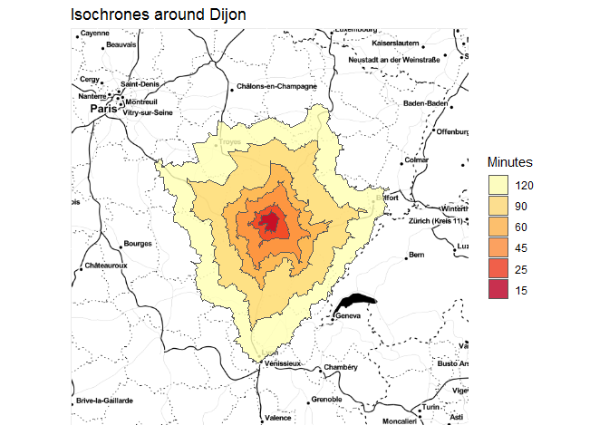
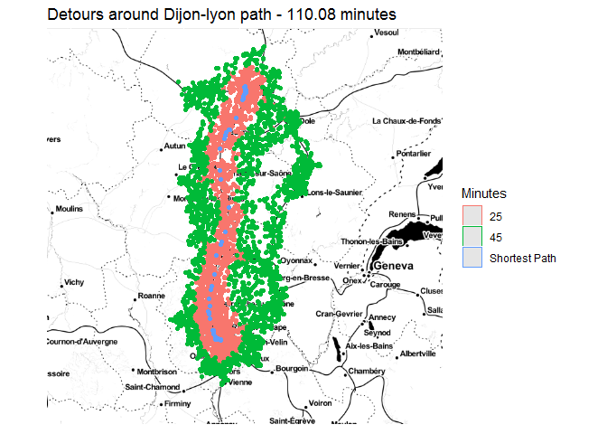
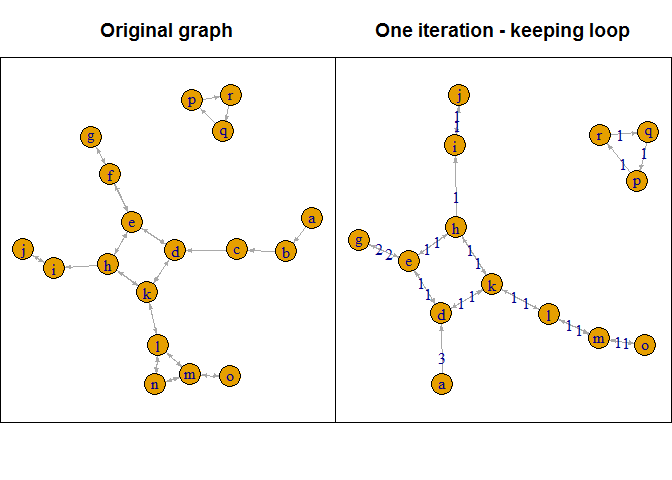

cppRouting package
================
Vincent LARMET
15 juin 2019

Package presentation
====================

`cppRouting` is an `R` package which provide functions to calculate distances, shortest paths and isochrones/isodistances on non-negative weighted graphs. For now, `cppRouting` can implement :

-   uni-directional Dijkstra algorithm,
-   bi-directional Dijkstra algorithm,
-   uni-directional A\* algorithm
-   New bi-directional A\* algorithm (Piljs & Post, 2009 : see <http://repub.eur.nl/pub/16100/ei2009-10.pdf>)

All these functions are written in C++ and use std::priority\_queue container from the Standard Template Library.
This package have been made with `Rcpp` and `parallel` packages.

Install
=======

### Stable version from CRAN

``` r
install.packages("cppRouting")
```

### or from github

``` r
library(devtools)
devtools::install_github("vlarmet/cppRouting")
```

Data
====

The data presented here is the official french road network describing over 500000 km of roads.
All data used in this README are free and can be downloaded here :

-   roads : <http://professionnels.ign.fr/route500>
-   general practitioners location : <https://www.insee.fr/fr/statistiques/3568614?sommaire=3568656#consulter>
-   maternity wards location : <https://www.insee.fr/fr/statistiques/3568611?sommaire=3568656#dictionnaire>
-   shapefile of the ~36000 communes in France : <http://professionnels.ign.fr/adminexpress>

Graph data have been preprocessed for more readability (see data\_preparation.R).

The final graph is composed of 234615 nodes and 685118 edges.
Data has to be a 3 columns data.frame or matrix containing from, to and a cost/distance column. Here the cost is the time needed to travel in each edges (in minutes). From and to are vertices IDs (character or numeric).

Main functions
==============

`cppRouting` package provide these functions :

-   `get_distance_matrix` : compute distance matrix (between all combinations origin-destination nodes - *one-to-many*),
-   `get_distance_pair` : compute distances between origin and destination by pair (*one-to-one*),
-   `get_path_pair` : compute shortest paths between origin and destination by pair (*one-to-one*),
-   `get_multi_paths` : compute shortest paths between all origin nodes and all destination nodes (*one-to-many*),
-   `get_isochrone` : compute isochrones/isodistances with one or multiple breaks.
-   `cpp_simplify` : remove non-intersection nodes, duplicated edges and isolated loops in the graph. Graph topology is preserved so distance calculation is faster and remains true. This function can be applied to very large graphs (several millions of nodes).

### Path algorithms

The choice between all the algorithms is available for *one-to-one* calculation like `get_distance_pair` and `get_path_pair`.
In these functions, uni-directional Dijkstra algorithm is stopped when the destination node is reached.
`A*` and `NBA*` are relevant if geographic coordinates of all nodes are provided. Note that coordinates should be expressed in a **projection system**.
To be accurate and efficient, `A*` and `NBA*` algorithms should use an admissible heuristic function (here the Euclidean distance), e.g cost and heuristic function must be expressed in the same unit.
In `cppRouting`, heuristic function `h` is defined such that : h(xi,yi,xdestination,ydestination)/k, with a constant k; so in the case where coordinates are expressed in meters and cost is expressed in time, k is the maximum speed allowed on the road. By default, constant is 1 and is designed for graphs with cost expressed in the same unit than coordinates (for example in meters).

If coordinates cannot be provided, bi-directional Dijkstra algorithm can offer a good alternative to A\* in terms of performance.

Examples
--------

### Prepare data

``` r
library(cppRouting)
library(dplyr)
library(sf)
library(ggplot2)
library(concaveman)
library(ggmap)

#Reading french road data
roads<-read.csv("roads.csv",colClasses = c("character","character","numeric"))
#Shapefile data of communes
com<-read_sf("com_simplified_geom.shp")
#Correspondance file between communes and nodes in the graph
ndcom<-read.csv("node_commune.csv",colClasses = c("character","character","numeric"))
#General practitioners locations
med<-read.csv("doctor.csv",colClasses = c("character","numeric","character","numeric"))
#Import nodes coordinates (projected in EPSG : 2154)
coord<-read.csv("coordinates.csv",colClasses = c("character","numeric","numeric"))
```

#### Head of road network data

``` r
head(roads)
```

    ##   from     to    weight
    ## 1    0 224073 0.4028571
    ## 2    1  65036 3.5280000
    ## 3    2 173723 1.8480000
    ## 4    3      2 2.5440000
    ## 5    4 113129 4.9680000
    ## 6    5      4 1.6680000

#### Head of coordinates data

``` r
head(coord)
```

    ##   ID        X       Y
    ## 1  0 805442.8 6458384
    ## 2  1 552065.9 6790520
    ## 3  2 556840.2 6790475
    ## 4  3 554883.7 6790020
    ## 5  4 548345.2 6791000
    ## 6  5 547141.3 6790434

### Instantiate the graph

``` r
#Instantiate a graph with coordinates
graph<-makegraph(roads,directed = T,coords = coord)
```

### Distances by pairs between nodes (*one-to-one*)

#### Using uni-directional Dijkstra algorithm

``` r
#Generate 2000 random origin and destination nodes
origin<-sample(roads$from,2000)
destination<-sample(roads$from,2000)

#Uni-directional : single core
system.time(
pair_dijkstra<-get_distance_pair(graph,origin,destination)
)
```

    ## Running Dijkstra ...

    ##    user  system elapsed 
    ##   58.87    0.74   59.86

#### Using bi-directional Dijkstra algorithm

``` r
#Bi-directional : single core
system.time(
pair_bidijkstra<-get_distance_pair(graph,origin,destination,algorithm = "bi")
)
```

    ## Running bidirectional Dijkstra...

    ##    user  system elapsed 
    ##   39.92    1.40   41.75

#### Using A\* algorithm

Coordinates are defined in meters and max speed is 110km/h; so for the heuristic function to be admissible, the constant equal 110/0.06 :

``` r
#A* single node
system.time(
pair_astar<-get_distance_pair(graph,origin,destination,algorithm = "A*",constant = 110/0.06)
)
```

    ## Running A* ...

    ##    user  system elapsed 
    ##   32.85    1.93   34.87

#### Using NBA\* algorithm

``` r
#NBA* single node
system.time(
pair_nba<-get_distance_pair(graph,origin,destination,algorithm = "NBA",constant = 110/0.06)
)
```

    ## Running NBA* ...

    ##    user  system elapsed 
    ##   18.34    2.97   21.32

#### Output

``` r
head(cbind(pair_dijkstra,pair_bidijkstra,pair_astar,pair_nba))
```

    ##      pair_dijkstra pair_bidijkstra pair_astar pair_nba
    ## [1,]      370.2267        370.2267   370.2267 370.2267
    ## [2,]      173.4823        173.4823   173.4823 173.4823
    ## [3,]      609.7753        609.7753   609.7753 609.7753
    ## [4,]      460.4252        460.4252   460.4252 460.4252
    ## [5,]      407.5842        407.5842   407.5842 407.5842
    ## [6,]      320.0234        320.0234   320.0234 320.0234

##### In `get_distance_pair` function, all the algorithms can be ran in parallel by setting TRUE to allcores argument.

### Compute isochrones

Let's compute isochrones around Dijon city

``` r
#Compute isochrones
iso<-get_isochrone(graph,from = "205793",lim = c(15,25,45,60,90,120))
#Convert nodes to concave polygons with concaveman package
poly<-lapply(iso[[1]],function(x){
  x<-data.frame(noeuds=x,stringsAsFactors = F)
  x<-left_join(x,coord,by=c("noeuds"="ID"))
  return(concaveman(summarise(st_as_sf(x,coords=c("X","Y"),crs=2154))))
})

poly<-do.call(rbind,poly)
poly$time<-as.factor(names(iso[[1]]))
#Multipolygon
poly2<-st_cast(poly,"MULTIPOLYGON")
poly2$time<-reorder(poly2$time,c(120,90,60,45,25,15))
#Reproject for plotting
poly2<-st_transform(poly2,"+proj=longlat +ellps=WGS84 +datum=WGS84 +no_defs")
#Import map backgroung
dijon=get_map(location=c(lon=5.041140,lat=47.323025),zoom=7, source="google",maptype = "toner-2010")
#Plot the map
p<-ggmap(dijon)+
  geom_sf(data=poly2,aes(fill=time),alpha=.8,inherit.aes = FALSE)+
  scale_fill_brewer(palette = "YlOrRd")+
  labs(fill="Minutes")+
  ggtitle("Isochrones around Dijon")+
  theme(axis.text.x = element_blank(),
        axis.text.y = element_blank(),
        axis.ticks = element_blank(),
        axis.title.y=element_blank(),axis.title.x=element_blank())
p
```



### Graph simplification

`cpp_simplify`'s internal function performs two major steps :

-   removing non-intersection nodes between two intersection nodes then calculate cost of the new edges,
-   removing duplicate edges that are potentially created in the first step.
    In order to remove maximum number of nodes, some iterations are needed until only intersection nodes are remained.

Let's see a small example :

``` r
library(igraph)
#Create directed graph
edges<-data.frame(from=c("a","b","c","d",
                         "d","e","e","e",
                         "f","f","g","h","h","h",
                         "i","j","k","k","k",
                         "l","l","l","m","m","m",
                         "n","n","o","p","q","r"),
                  to=c("b","c","d","e","k","f","d",
                       "h","g","e","f","e","i","k",
                       "j","i","h","d","l","k",
                       "m","n","n","o","l","l","m","m",
                       "r","p","q"),
                  dist=rep(1,31))

#Plotting with igraph
par(mfrow=c(1,2),mar=c(3,0,3,0))

igr1<-graph_from_data_frame(edges)
set.seed(2)
plot.igraph(igr1,edge.arrow.size=.3,main="Original graph")
box(col="black")

#Instantiate cppRouting graph, then simplify without iterations
graph_ex<-makegraph(edges,directed = TRUE)
simp<-cpp_simplify(graph_ex,rm_loop = FALSE)
#Convert graph to df
edges2<-to_df(simp$graph)

#Plotting simplified graph
igr2<-graph_from_data_frame(edges2)
set.seed(2)
plot(igr2,edge.arrow.size=.3,edge.label=E(igr2)$dist,main="One iteration - keeping loop")
box(col="black")
```



Here, junction nodes are `e`, `h`, `d`, `k`, `l`, `i` and `m`. So `b`, `c`, `f` and `n` have been contracted in the first step of the function. By contracting `n`, an edge with cost of 2 has been created between `m` and `l` nodes.
The second step of the function has removed this edge which is greater than the original one (e.g 1), and the whole process now need a second iteration to remove `m` and `l` that aren't intersection nodes anymore.
Let's try with `iterate` argument set to `TRUE` :

``` r
par(mfrow=c(1,2),mar=c(3,0,3,0))
#Simplify with iterations
simp2<-cpp_simplify(graph_ex,rm_loop = FALSE,iterate = TRUE)
edges3<-to_df(simp2$graph)
igr3<-graph_from_data_frame(edges3)
set.seed(2)
plot(igr3,edge.arrow.size=.3,edge.label=E(igr3)$dist,main="Second iteration - keeping loop")
box(col="black")

#The same but removing loops
simp3<-cpp_simplify(graph_ex,rm_loop = TRUE,iterate = TRUE)
edges4<-to_df(simp3$graph)

igr4<-graph_from_data_frame(edges4)
set.seed(2)
plot(igr4,edge.arrow.size=.3,edge.label=E(igr4)$dist,main="Second iteration - removing loop")
box(col="black")
```



#### French road network simplification

``` r
#Simplify original graph by keeping nodes of interest
graph2<-cpp_simplify(graph,
                     iterate = TRUE,
                     keep = unique(c(origin,destination)))

#Running NBA*
system.time(
  pair_nba_2<-get_distance_pair(graph2$graph,origin,destination,algorithm = "NBA",constant = 110/0.06)
)
```

    ##    user  system elapsed 
    ##   14.81    1.37   16.24

##### Compare outputs

``` r
summary(pair_nba-pair_nba_2)
```

    ##    Min. 1st Qu.  Median    Mean 3rd Qu.    Max.    NA's 
    ##       0       0       0       0       0       0      35

#### Running time

Here are running times in second on graphs of different sizes (data presented here, TEXAS road network from [SNAP](http://snap.stanford.edu/data/roadNet-TX.html) and french road network from OpenStreetMap and extracted with [osm2po](https://osm2po.de/) tool).

<table>
<thead>
<tr>
<th style="text-align:left;">
Network
</th>
<th style="text-align:right;">
Nodes
</th>
<th style="text-align:right;">
Edges
</th>
<th style="text-align:right;">
Runtime without iterations
</th>
<th style="text-align:right;">
Removed nodes in first iteration
</th>
<th style="text-align:right;">
Runtime with iterations
</th>
<th style="text-align:right;">
Number of iteration
</th>
<th style="text-align:right;">
Total removed nodes
</th>
<th style="text-align:right;">
Removed nodes percentage
</th>
</tr>
</thead>
<tbody>
<tr>
<td style="text-align:left;">
README data
</td>
<td style="text-align:right;">
234,615
</td>
<td style="text-align:right;">
685,118
</td>
<td style="text-align:right;">
0.84
</td>
<td style="text-align:right;">
31,357
</td>
<td style="text-align:right;">
2.20
</td>
<td style="text-align:right;">
4
</td>
<td style="text-align:right;">
41,870
</td>
<td style="text-align:right;">
17.84
</td>
</tr>
<tr>
<td style="text-align:left;">
SNAP
</td>
<td style="text-align:right;">
1,379,917
</td>
<td style="text-align:right;">
3,843,320
</td>
<td style="text-align:right;">
3.40
</td>
<td style="text-align:right;">
115,639
</td>
<td style="text-align:right;">
23.18
</td>
<td style="text-align:right;">
9
</td>
<td style="text-align:right;">
125,500
</td>
<td style="text-align:right;">
9.09
</td>
</tr>
<tr>
<td style="text-align:left;">
OSM
</td>
<td style="text-align:right;">
4,559,270
</td>
<td style="text-align:right;">
10,380,371
</td>
<td style="text-align:right;">
18.70
</td>
<td style="text-align:right;">
751,541
</td>
<td style="text-align:right;">
93.00
</td>
<td style="text-align:right;">
9
</td>
<td style="text-align:right;">
843,595
</td>
<td style="text-align:right;">
18.50
</td>
</tr>
</tbody>
</table>
Applications
============

Application 1 : Calculate Two Step Floating Catchment Areas (2SFCA) of general practitioners in France
------------------------------------------------------------------------------------------------------

2SFCA method is explained here : <https://en.wikipedia.org/wiki/Two-step_floating_catchment_area_method>

### First step

Isochrones are calculated with the `cppRouting` function `get_isochrone`

``` r
#Isochrone around doctor locations with time limit of 15 minutes
iso<-get_isochrone(graph,from = ndcom[ndcom$com %in% med$CODGEO,"id_noeud"],lim = 15)
#Convert list to long data frame
df<-stack(setNames(iso, seq_along(iso)))
df$ind<-rep(names(iso),times=sapply(iso,length))
df<-df[df$values %in% ndcom$id_noeud,]
#Joining and summing population located in each isochrone
df<-left_join(df,ndcom[,c("id_noeud","POPULATION")],by=c("values"="id_noeud"))
df<-df %>% group_by(ind) %>%
  summarise(pop=sum(POPULATION))
#Joining number of doctors 
df<-left_join(df,med[,c("id_noeud","NB_D201")],by=c("ind"="id_noeud"))
#Calculate ratios
df$ratio<-df$NB_D201/df$pop
```

### Second step

``` r
#Isochrone around each commune with time limit of 15 minutes (few seconds to compute)
iso2<-get_isochrone(graph,from=ndcom$id_noeud,lim = 15)
#Convert list to long data frame
df2<-stack(setNames(iso2, seq_along(iso2)))
df2$ind<-rep(names(iso2),times=sapply(iso2,length))
#Joining and summing ratios calculated in first step
df2<-left_join(df2,df[,c("ind","ratio")],by=c("values"="ind"))
df2<-df2 %>% group_by(ind) %>%
  summarise(sfca=sum(ratio,na.rm=T))
```

### Plot the map for Bourgogne-Franche-Comte region

``` r
#Joining commune IDs to nodes
df2<-left_join(df2,ndcom[,c("id_noeud","com")],by=c("ind"="id_noeud"))
#Joining 2SFCA to shapefile
com<-left_join(com,df2[,c("com","sfca")],by=c("INSEE_COM"="com"))
#Plot for one region
p<-ggplot()+
  geom_sf(data=com[com$NOM_REG=="BOURGOGNE-FRANCHE-COMTE",],aes(fill=sfca),colour=NA)+
  coord_sf(datum=NA)+
  scale_fill_gradient(low="#BB2528",high = "#FFFF66")+
  labs(fill="2SFCA")+
  ggtitle("2SFCA applied to general practitioners")
p
```


Application 2 : Calculate the minimum travel time to the closest maternity ward in France
-----------------------------------------------------------------------------------------

``` r
#Import materinty ward locations
maternity<-read.csv("maternity.csv",colClasses = c("character","numeric"))
```

### Shortest travel time matrix

The shortest travel time is computed with the `cppRouting` function `get_distance_matrix`. In order to compute multiple distances from one source, original uni-directional Dijkstra algorithm is ran without early stopping.
We compute travel time from all commune nodes to all maternity ward nodes (e.g ~36000\*400 distances).

``` r
#Distance matrix (around 10 minutes to compute)
dists<-get_distance_matrix(graph,
                           from=ndcom$id_noeud,
                           to=ndcom$id_noeud[ndcom$com %in% maternity$CODGEO],
                           allcores=TRUE)
#We extract each minimum travel time for all the communes
dists2<-data.frame(node=ndcom$id_noeud,mindist=apply(dists,1,min,na.rm=T))
#Joining commune IDs to nodes
dists2<-left_join(dists2,ndcom[,c("id_noeud","com")],by=c("node"="id_noeud"))
#Joining minimum travel time to the shapefile
com<-left_join(com,dists2[,c("com","mindist")],by=c("INSEE_COM"="com"))
```

Plot the map of minimum travel time in Bourgogne-Franche-Comte region
=====================================================================

``` r
p<-ggplot()+
  geom_sf(data=com[com$NOM_REG=="BOURGOGNE-FRANCHE-COMTE",],aes(fill=mindist),colour=NA)+
  coord_sf(datum=NA)+
  scale_fill_gradient(low="#009900",high="#003300")+
  labs(fill="Minutes")+
  ggtitle("Travel time to the closest maternity ward")
p
```


Benchmark with other R packages
===============================

To show the efficiency of `cppRouting`, we can make some benchmarking with the famous R package `igraph`, and the `dodgr` package which provide highly optimized heaps.

### Distance matrix : one core

``` r
library(igraph)
library(dodgr)
#Sampling 1000 random origin/destination nodes (1000000 distances to compute)
origin<-sample(unique(roads$from),1000,replace = F)
destination<-sample(unique(roads$from),1000,replace = F)
```

``` r
#igraph 
graph_igraph<-graph_from_data_frame(roads,directed = TRUE)

system.time(
  test_igraph<-distances(graph_igraph,origin,to=destination,weights = E(graph_igraph)$weight,mode="out")
)
```

    ##    user  system elapsed 
    ##   89.63    0.02   89.83

``` r
#dodgr
#Adding coordinates to data
roads2<-roads
colnames(roads2)[3]<-"dist"
roads2<-left_join(roads2,coord,by=c("from"="ID"))
colnames(roads2)[4:5]<-c("from_lon","from_lat")
roads2<-left_join(roads2,coord,by=c("to"="ID"))
colnames(roads2)[6:7]<-c("to_lon","to_lat")
colnames(roads2)[1:2]<-c("from_id","to_id")
roads2$from_id<-as.character(roads2$from_id)
roads2$to_id<-as.character(roads2$to_id)

system.time(
test_dodgr<-dodgr_dists(graph=data.frame(roads2),from=origin,to=destination,parallel=FALSE)
)
```

    ##    user  system elapsed 
    ##   90.09    0.09   90.78

``` r
#cppRouting
system.time(
test_cpp<-get_distance_matrix(graph,origin,destination,allcores = FALSE)
)
```

    ##    user  system elapsed 
    ##   62.66    0.40   63.48

#### Ouput

``` r
head(cbind(test_igraph[,1],test_dodgr[,1],test_cpp[,1]))
```

    ##            [,1]     [,2]     [,3]
    ## 210536 258.3182 258.3182 258.3182
    ## 191662 153.5894 153.5894 153.5894
    ## 94621  165.1604 165.1604 165.1604
    ## 62351  400.0621 400.0621 400.0621
    ## 194066 149.2815 149.2815 149.2815
    ## 47812  247.8106 247.8106 247.8106

### Distance matrix : parallel

``` r
#dodgr
system.time(
test_dodgr<-dodgr_dists(graph=data.frame(roads2),from=origin,to=destination,parallel=TRUE)
)
```

    ##    user  system elapsed 
    ##  134.15    0.42   36.97

``` r
#cppRouting
system.time(
test_cpp<-get_distance_matrix(graph,origin,destination,allcores = TRUE)
)
```

    ##    user  system elapsed 
    ##    0.11    0.08   23.82

Benchmark on computing shortest paths by pairs
----------------------------------------------

``` r
#Sampling 500 random origin/destination nodes 
origin<-sample(unique(roads$from),500,replace = F)
destination<-sample(unique(roads$from),500,replace = F)
#dodgr
system.time(
test_dodgr<-dodgr_paths(graph=data.frame(roads2),from=origin,to=destination,pairwise = TRUE)
)
```

    ##    user  system elapsed 
    ##  561.26   20.80  587.54

``` r
#cppRouting
system.time(
test_cpp<-get_path_pair(graph,origin,destination,algorithm = "NBA",constant=110/0.06)
)
```

    ## Running NBA* ...

    ##    user  system elapsed 
    ##    5.24    0.31    5.56

### Test similarity of the first travel

``` r
#Number of nodes
length(test_dodgr[[1]][[1]])
```

    ## [1] 162

``` r
length(test_cpp[[1]])
```

    ## [1] 162

``` r
#Setdiff 
setdiff(test_dodgr[[1]][[1]],test_cpp[[1]])
```

    ## character(0)

New algorithms `cppRouting` will provide in the future
======================================================

-   Detours admitting shortest paths : finding the nodes that are reachable under a fixed detour time around the shortest path
-   Contraction hierarchies implementation
