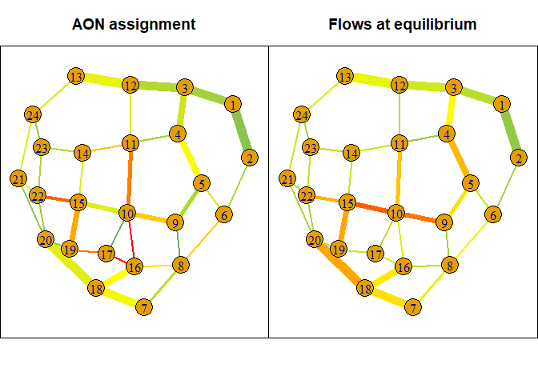

# Support Our Open Source Project

Creating and maintaining an open source project takes significant time and effort. If you find value in our work and would like to see it continue to grow and improve, please consider making a donation. Your support helps us cover hosting costs, development tools, and allows us to dedicate more time to enhancing this project. Every contribution, no matter how small, makes a big difference. Thank you for supporting open source!  

[](https://www.paypal.com/donate/?hosted_button_id=SNBP8ZWMMYCDA)

cppRouting v3 : Algorithms for Routing and Solving the Traffic
Assignment Problem
================
Vincent LARMET
November 24, 2022

-   [Package presentation](#package-presentation)
-   [Installation](#installation)
    -   [Stable version from CRAN](#stable-version-from-cran)
    -   [or from github](#or-from-github)
-   [What are we talking about ?](#what-are-we-talking-about-)
-   [Readme Data](#readme-data)
    -   [Set the number of threads used by
        `cppRouting`](#set-the-number-of-threads-used-by-cpprouting)
    -   [Instantiate the graph](#instantiate-the-graph)
-   [Main functions](#main-functions)
-   [Routing](#routing)
    -   [Algorithms](#algorithms)
    -   [Compute isochrones](#compute-isochrones)
    -   [Compute possible detours within a fixed additional
        cost](#compute-possible-detours-within-a-fixed-additional-cost)
    -   [Contraction hierarchies](#contraction-hierarchies)
    -   [Work with dual weighted
        network](#work-with-dual-weighted-network)
-   [Network simplification](#network-simplification)
-   [Traffic assignment](#traffic-assignment)
    -   [All-or-Nothing (AON)](#all-or-nothing-aon)
        -   [Choosing the best routing
            algorithm](#choosing-the-best-routing-algorithm)
    -   [User Equilibrium (UE)](#user-equilibrium-ue)
        -   [Link-based algorithms](#link-based-algorithms)
        -   [Bush-based algorithms](#bush-based-algorithms)
        -   [Performance comparison](#performance-comparison-1)
-   [Algorithm compatibility](#algorithm-compatibility)
-   [Parallel implementation](#parallel-implementation)
-   [Applications](#applications)
    -   [Application 1 : Calculate Two Step Floating Catchment Areas
        (2SFCA) of general practitioners in
        France](#application-1--calculate-two-step-floating-catchment-areas-2sfca-of-general-practitioners-in-france)
    -   [Application 2 : Calculate the minimum travel time to the
        closest maternity ward in
        France](#application-2--calculate-the-minimum-travel-time-to-the-closest-maternity-ward-in-france)
    -   [Application 3 : Calculate average commuting time to go to job
        in
        France](#application-3--calculate-average-commuting-time-to-go-to-job-in-france)
    -   [Application 4 : Calculate the flow of people crossing each
        municipality in the context of commuting in
        Bourgogne-Franche-Comte
        region](#application-4--calculate-the-flow-of-people-crossing-each-municipality-in-the-context-of-commuting-in-bourgogne-franche-comte-region)
-   [Benchmark with other R packages](#benchmark-with-other-r-packages)
-   [Citation](#citation)

# Package presentation

`cppRouting` is an `R` package which provide **routing** algorithms
(shortest paths/distances, isochrones) and **traffic assignment**
solvers on non-negative weighted graphs.  
`cppRouting` is characterized by :

-   its ability to work on large road graphs (country/continent scale)
-   its large choice of `one-to-one` shortest path algorithms
-   its implementation of **contraction hierarchies** and associated
    routing algorithms
-   its large choice of algorithms for solving the **traffic assignment
    problem (TAP)**
-   its high performance through memory usage and parallel programming

`cppRouting` is therefore particularly adapted for geographer, or
whoever who need to calculate accessibility indicators at large scale.  
All algorithms are written in C++ and mainly use containers from the
Standard Template Library (STL).  
This package have been made with `Rcpp` and `RcppParallel` packages.

# Installation

### Stable version from CRAN

``` r
install.packages("cppRouting")
```

### or from github

``` r
library(remotes)
remotes::install_github("vlarmet/cppRouting")
```

# What are we talking about ?

`cppRouting` implements algorithms belonging to **graph theory**, so
let’s define what a graph is.  
A graph is commonly used to represent a network, which is composed of
vertices connected by edges.

<!-- -->

In `cppRouting`, an edge has at least three attributes : vertice’s ID
from which it start, vertice’s ID from which it end and a weight
(length, flow, travel time …).

# Readme Data

**This README file and all time measurements were made on a Windows 10
computer, with 11th generation i5 (6 cores) processor and 32GB of
memory. **  
The data presented here is the official french road network describing
over 500000 km of roads.  
All data used in this README are free and can be downloaded here :

-   roads : <http://professionnels.ign.fr/route500>  
-   general practitioners location :
    <https://www.insee.fr/fr/statistiques/3568614?sommaire=3568656#consulter>  
-   maternity wards location :
    <https://www.insee.fr/fr/statistiques/3568611?sommaire=3568656#dictionnaire>  
-   shapefile of the \~36000 communes in France :
    <http://professionnels.ign.fr/adminexpress>  
-   commuting to work from the French national census :
    <https://www.insee.fr/fr/statistiques/3566477#consulter>

Graph data have been preprocessed for more readability (see
data_preparation.R).

The final graph is composed of 234615 nodes and 685118 edges.  
Data has to be a 3 columns data.frame or matrix containing from, to and
a cost/distance column. Here the cost is the time needed to travel in
each edges (in minutes). From and to are vertices IDs (character or
numeric).

``` r
library(cppRouting)
library(dplyr)
library(sf)
library(ggplot2)
library(concaveman)
library(ggmap)
library(tmap)
library(microbenchmark)
library(reshape2)
library(kableExtra)

#Reading french road data
roads  <-  read.csv("roads.csv",colClasses = c("character","character","numeric"))
#Shapefile data of communes (polygons)
com  <-  read_sf("com_simplified_geom.shp")
#Correspondance file between communes and nodes in the graph (nearest node to each commune centroid)
ndcom  <-  read.csv("node_commune.csv",colClasses = c("character","character","numeric"))
#General practitioners locations
med  <-  read.csv("doctor.csv",colClasses = c("character","numeric","character","numeric"))
#Import materinty ward locations
maternity  <-  read.csv("maternity.csv",colClasses = c("character","numeric"))
#Commuting data from national census
load("commuting.Rds")
#Import nodes coordinates (projected in EPSG : 2154)
coord  <-  read.csv("coordinates.csv",colClasses = c("character","numeric","numeric"))
```

#### Head of road network data

``` r
head(roads)
```

    ##   from     to    weight
    ## 1    0 224073 0.4028571
    ## 2    1  65036 3.5280000
    ## 3    2 173723 1.8480000
    ## 4    3      2 2.5440000
    ## 5    4 113129 4.9680000
    ## 6    5      4 1.6680000

#### Head of coordinates data

``` r
head(coord)
```

    ##   ID        X       Y
    ## 1  0 805442.8 6458384
    ## 2  1 552065.9 6790520
    ## 3  2 556840.2 6790475
    ## 4  3 554883.7 6790020
    ## 5  4 548345.2 6791000
    ## 6  5 547141.3 6790434

### Set the number of threads used by `cppRouting`

``` r
RcppParallel::setThreadOptions(numThreads = 1)
```

### Instantiate the graph

``` r
#Instantiate a graph with coordinates
graph  <-  makegraph(roads, directed = T, coords = coord)
```

Graph object have some useful attributes for the user :  
- `graph$nbnode` : total number of vertices,  
- `graph$dict$ref` : vertices ids.

Other attributes are internals data and have no interest for the user.
All graph attributes should **never** be modified by the user.

# Main functions

`cppRouting` package provide these functions :

-   `get_distance_matrix` : compute distance matrix (between all
    combinations origin-destination nodes - *one-to-many*),  
-   `get_distance_pair` : compute distances between origin and
    destination by pair (*one-to-one*),  
-   `get_path_pair` : compute shortest paths between origin and
    destination by pair (*one-to-one*),  
-   `get_multi_paths` : compute shortest paths between all origin nodes
    and all destination nodes (*one-to-many*),  
-   `get_isochrone` : compute isochrones/isodistances with one or
    multiple breaks.  
-   `get_detour` : return nodes that are reachable within a fixed
    additional cost around shortest paths. This function can be useful
    in producing accessibility indicators.  
-   `cpp_simplify` : remove non-intersection nodes, duplicated edges and
    isolated loops in the graph. Graph topology is preserved so distance
    calculation is faster and remains true. This function can be applied
    to very large graphs (several millions of nodes).  
-   `cpp_contract` : contract the graph by applying **contraction
    hierarchies** algorithm.  
-   `get_aon` : given an origin-destination matrix, compute
    All-or-Nothing assignment.  
-   `assign_traffic` : given an origin-destination matrix, estimate the
    traffic flows on the network.

# Routing

As the package name suggest, `cppRouting` is initially aimed to provide
efficient algorithms for finding shortest paths.

## Algorithms

Path algorithms proposed by the package are :

-   **1** uni-directional Dijkstra algorithm,
-   **2** bi-directional Dijkstra algorithm,
-   **3** uni-directional A\* algorithm  
-   **4** New bi-directional A\* algorithm (Piljs & Post, 2009 : see
    <http://repub.eur.nl/pub/16100/ei2009-10.pdf>)
-   **5** *one-to-one* bi-directional Dijkstra adapted to contraction
    hierarchies (Geisberger & al., 2008)
-   **6** *many-to-many* bi-directional Dijkstra adapted to contraction
    hierarchies (Geisberger & al., 2008)
-   **7** PHAST algorithm (Hardware-accelerated shortest path trees),
    *one-to-all* algorithm adapted to contraction hierarchies (Delling &
    al., 2011)

*1*, *2*, *3* and *4* are available for **one-to-one** calculation in
`get_distance_pair` and `get_path_pair` functions on a
**non-contracted** graph. In these functions, uni-directional Dijkstra
algorithm is stopped when the destination node is reached.  
`A*` and `NBA*` are relevant if geographic coordinates of all nodes are
provided. Note that coordinates should be expressed in a **projection
system**.  
To be accurate and efficient, `A*` and `NBA*` algorithms should use an
admissible heuristic function (here the Euclidean distance), i.e cost
and heuristic function must be expressed in the same unit.  
In `cppRouting`, heuristic function `h` for a node (n) is defined such
that :  
**h(n,d) = ED(n,d) / k** with *h* the heuristic, *ED* the Euclidean
distance, *d* the destination node and a constant *k*.  
So in the case where coordinates are expressed in meters and cost is
expressed in time, *k* is the maximum speed allowed on the road. By
default, constant is 1 and is designed for graphs with cost expressed in
the same unit than coordinates (for example in meters).  
If coordinates cannot be provided, bi-directional Dijkstra algorithm is
the best option in terms of performance.

*5* is used for **one-to-one** calculation in `get_distance_pair` and
`get_path_pair` functions on a **contracted** graph.

*1* is used for **one-to-many** calculation in `get_distance_matrix`
function on a **non-contracted** graph.

*6* and *7* are available for **one-to-many** calculation in
`get_distance_matrix` function on a **contracted** graph.

Let’s compare different path algorithms in terms of performance.  
For `A*` and `NBA` algorithms, coordinates are defined in meters and max
speed is 110km/h; so for the heuristic function to be admissible, we
have to convert meters to minutes by setting constant to 110/0.06 :

``` r
#Generate 2000 random origin and destination nodes
origin  <-  sample(graph$dict$ref,  2000)
destination  <-  sample(graph$dict$ref,  2000)
microbenchmark(dijkstra=pair_dijkstra  <-  get_distance_pair(graph, origin, destination, algorithm = "Dijkstra"), 
               bidir=pair_bidijkstra  <-  get_distance_pair(graph, origin, destination, algorithm = "bi"), 
               astar=pair_astar  <-  get_distance_pair(graph, origin, destination, algorithm = "A*", constant = 110/0.06), 
               nba=pair_nba  <-  get_distance_pair(graph, origin, destination, algorithm = "NBA", constant = 110/0.06), 
               times=1)
```

    ## Unit: seconds
    ##      expr       min        lq      mean    median        uq       max neval
    ##  dijkstra 28.648378 28.648378 28.648378 28.648378 28.648378 28.648378     1
    ##     bidir 22.463780 22.463780 22.463780 22.463780 22.463780 22.463780     1
    ##     astar 19.207150 19.207150 19.207150 19.207150 19.207150 19.207150     1
    ##       nba  9.976939  9.976939  9.976939  9.976939  9.976939  9.976939     1

#### Output

``` r
head(cbind(pair_dijkstra,pair_bidijkstra,pair_astar,pair_nba))
```

    ##      pair_dijkstra pair_bidijkstra pair_astar pair_nba
    ## [1,]      258.4616        258.4616   258.4616 258.4616
    ## [2,]      464.5499        464.5499   464.5499 464.5499
    ## [3,]      294.5504        294.5504   294.5504 294.5504
    ## [4,]      302.7190        302.7190   302.7190 302.7190
    ## [5,]      120.1393        120.1393   120.1393 120.1393
    ## [6,]      578.0233        578.0233   578.0233 578.0233

So, how to choose the algorithm ? It’s simple, the faster, the better.
If coordinates are provided, go for `NBA`, else go for bidirectional
Dijkstra. Uni-directional Dijkstra and `A*` algorithms should be used if
main memory is (almost) full because they require only one graph instead
of two (forward and backward).

## Compute isochrones

An isochrone is a set of nodes reachable from a node within a fixed
limit.  
Let’s compute isochrones around Dijon city

``` r
#Compute isochrones
iso  <-  get_isochrone(graph, from = "205793", lim = c(15, 25, 45, 60, 90, 120))
#Convert nodes to concave polygons with concaveman package
poly  <-  lapply(iso[[1]], function(x){
  x  <-  data.frame(noeuds=x, stringsAsFactors = F)
  x  <-  left_join(x, coord, by=c("noeuds"="ID"))
  return(concaveman(summarise(st_as_sf(x, coords=c("X", "Y"), crs=2154))))
})

poly  <-  do.call(rbind, poly)
poly$time  <-  as.factor(names(iso[[1]]))
#Multipolygon
poly2  <-  st_cast(poly, "MULTIPOLYGON")
poly2$time  <-  reorder(poly2$time, c(120, 90, 60, 45, 25, 15))
#Reproject for plotting
poly2  <-  st_transform(poly2, "+proj=longlat +ellps=WGS84 +datum=WGS84 +no_defs")
#Import map backgroung

dijon   <-   get_stamenmap(bbox = c(left = 1.708, 
                             bottom = 45.126, 
                             right = 8.003, 
                             top = 49.232),  maptype = "toner-2010",  zoom = 7)
#Plot the map
p  <-  ggmap(dijon)+
  geom_sf(data=poly2, aes(fill=time), alpha=.8, inherit.aes = FALSE)+
  scale_fill_brewer(palette = "YlOrRd")+
  labs(fill="Minutes")+
  ggtitle("Isochrones around Dijon")+
  theme(axis.text.x = element_blank(), 
        axis.text.y = element_blank(), 
        axis.ticks = element_blank(), 
        axis.title.y=element_blank(), axis.title.x=element_blank())
p
```

<!-- -->

## Compute possible detours within a fixed additional cost

`get_detour` function returns all reachable nodes within a fixed detour
time around the shortest path between origin and destination nodes.
Returned nodes (n) meet the following condition :  
**SP(o,n) + SP(n,d) \< SP(o,d) + t**  
with *SP* shortest distance/time, *o* the origin node, *d* the
destination node and *t* the extra cost.  
The algorithm used is a slightly modified bidirectional Dijkstra.  
Let’s see an example for the path between Dijon and Lyon city :

``` r
#Compute shortest path
trajet <- get_path_pair(graph,from="205793",to="212490")

#Compute shortest path
distance <- get_distance_pair(graph,from="205793",to="212490")

#Compute detour time of 25 and 45 minutes
det25 <- get_detour(graph,from="205793",to="212490",extra=25)
det45 <- get_detour(graph,from="205793",to="212490",extra=45)

#Create sf object of nodes
pts <- st_as_sf(coord,coords=c("X","Y"),crs=2154)
pts <- st_transform(pts,crs=4326)
pts$time <- ifelse(pts$ID %in% unlist(det45),"45","0")
pts$time <- ifelse(pts$ID %in% unlist(det25),"25",pts$time)
pts$time <- ifelse(pts$ID %in% unlist(trajet),"Shortest Path",pts$time)
pts$time <- factor(pts$time,levels = c("25","45","Shortest Path","0"))

#Plot
dijon   <-   get_stamenmap(bbox = c(left = 3.2, 
                             bottom = 45.126, 
                             right = 6.5, 
                             top = 47.8),  maptype = "toner-2010",  zoom = 8)

p <- ggmap(dijon)+
  geom_sf(data=pts[pts$time!="0",],aes(color=time),inherit.aes = FALSE)+
  ggtitle(paste0("Detours around Dijon-lyon path - ",round(distance,digits = 2)," minutes"))+
  labs(color="Minutes")+
  theme(axis.text.x = element_blank(),
        axis.text.y = element_blank(),
        axis.ticks = element_blank(),
        axis.title.y=element_blank(),axis.title.x=element_blank())
p
```

<!-- -->

## Contraction hierarchies

Contraction hierarchies is a speed-up technique for finding shortest
path on a network. It was proposed by Geisberger & al.(2008).  
Initially created for *one-to-one* queries, it has been extended to
*many-to-many* and distance matrix calculation.  
This technique is composed of two phases:

-   preprocessing phase called *contraction* with `cpp_contract`
    function
-   query phase : a slightly modified version of bidirectional search
    for `one-to-one` query, available in `get_distance_pair` and
    `get_path_pair`; PHAST algorithm and a `many-to-many` algorithm
    using buckets available in `get_distance_matrix` function.

Contraction phase consists of iteratively removing a vertex **v** from
the graph and creating a shortcut for each pair **(u,w)** of **v**’s
neighborhood if the shortest path from **u** to **w** contains **v**. To
be efficient and avoid creating too much shortcuts, vertices have to be
ordered according to several heuristics. The two heuristics used by
`cppRouting` are :

-   *edge difference* (number of shortcuts potentially created by
    removing *v* - number of incoming edges - number of outcoming edges)
-   *deleted neighbors* (number of already contracted neighbors)

The nodes are initially ordered using only *edge difference*, then
importance of *v* is *lazily* updated during contraction phase with the
combined two heuristics. To see more detailed explanations, see these
ressources :

-   [quick
    review](https://pdfs.semanticscholar.org/3871/1351fa5749714370786ed17565e478c459d7.pdf)
-   [authors
    article](http://algo2.iti.kit.edu/schultes/hwy/contract.pdf)
-   [detailed author
    thesis](http://algo2.iti.kit.edu/documents/routeplanning/geisberger_dipl.pdf)

``` r
#Contraction of input graph
graph3 <- cpp_contract(graph, silent=TRUE)

#Calculate distances on the contracted graph
system.time(
  pair_ch <- get_distance_pair(graph3, origin, destination)
)
```

    ## utilisateur     système      écoulé 
    ##        0.27        0.01        0.28

#### Compare outputs

``` r
summary(pair_ch-pair_dijkstra)
```

    ##    Min. 1st Qu.  Median    Mean 3rd Qu.    Max.    NA's 
    ##       0       0       0       0       0       0      38

#### Performance comparison

##### Distance by pair

Here are the measurements of contraction time and query time (in second)
of contraction hierarchies on different graphs :
<table class="table" style="width: auto !important; margin-left: auto; margin-right: auto;">
<thead>
<tr>
<th style="empty-cells: hide;border-bottom:hidden;" colspan="5">
</th>
<th style="border-bottom:hidden;padding-bottom:0; padding-left:3px;padding-right:3px;text-align: center; " colspan="6">

<div style="border-bottom: 1px solid #ddd; padding-bottom: 5px; ">

Number of queries

</div>

</th>
</tr>
<tr>
<th style="text-align:center;">
Graph
</th>
<th style="text-align:center;">
Vertices
</th>
<th style="text-align:center;">
Edges
</th>
<th style="text-align:center;">
preprocessing
</th>
<th style="text-align:center;">
algorithm
</th>
<th style="text-align:center;">
1000
</th>
<th style="text-align:center;">
2000
</th>
<th style="text-align:center;">
5000
</th>
<th style="text-align:center;">
10000
</th>
<th style="text-align:center;">
100000
</th>
<th style="text-align:center;">
1000000
</th>
</tr>
</thead>
<tbody>
<tr>
<td style="text-align:center;font-weight: bold;font-weight: bold;">
ROUTE 500
</td>
<td style="text-align:center;font-weight: bold;">
234615
</td>
<td style="text-align:center;font-weight: bold;">
685118
</td>
<td style="text-align:center;font-weight: bold;">
14
</td>
<td style="text-align:center;font-weight: bold;">
ch
</td>
<td style="text-align:center;font-weight: bold;">
0.22
</td>
<td style="text-align:center;font-weight: bold;">
0.25
</td>
<td style="text-align:center;font-weight: bold;">
0.44
</td>
<td style="text-align:center;font-weight: bold;">
0.64
</td>
<td style="text-align:center;font-weight: bold;">
4.60
</td>
<td style="text-align:center;font-weight: bold;">
45.86
</td>
</tr>
<tr>
<td style="text-align:center;font-weight: bold;">
ROUTE 500
</td>
<td style="text-align:center;">
234615
</td>
<td style="text-align:center;">
685118
</td>
<td style="text-align:center;">
14
</td>
<td style="text-align:center;">
bi
</td>
<td style="text-align:center;">
11.00
</td>
<td style="text-align:center;">
22.00
</td>
<td style="text-align:center;">
55.00
</td>
<td style="text-align:center;">
110.00
</td>
<td style="text-align:center;">
1100.00
</td>
<td style="text-align:center;">
11000.00
</td>
</tr>
<tr>
<td style="text-align:center;font-weight: bold;">
ROUTE 500
</td>
<td style="text-align:center;">
234615
</td>
<td style="text-align:center;">
685118
</td>
<td style="text-align:center;">
14
</td>
<td style="text-align:center;">
nba
</td>
<td style="text-align:center;">
5.05
</td>
<td style="text-align:center;">
10.10
</td>
<td style="text-align:center;">
25.25
</td>
<td style="text-align:center;">
50.50
</td>
<td style="text-align:center;">
505.00
</td>
<td style="text-align:center;">
5050.00
</td>
</tr>
<tr>
<td style="text-align:center;font-weight: bold;font-weight: bold;">
OSM France
</td>
<td style="text-align:center;font-weight: bold;">
4559270
</td>
<td style="text-align:center;font-weight: bold;">
10389741
</td>
<td style="text-align:center;font-weight: bold;">
154
</td>
<td style="text-align:center;font-weight: bold;">
ch
</td>
<td style="text-align:center;font-weight: bold;">
4.08
</td>
<td style="text-align:center;font-weight: bold;">
3.92
</td>
<td style="text-align:center;font-weight: bold;">
4.66
</td>
<td style="text-align:center;font-weight: bold;">
5.11
</td>
<td style="text-align:center;font-weight: bold;">
18.20
</td>
<td style="text-align:center;font-weight: bold;">
147.05
</td>
</tr>
<tr>
<td style="text-align:center;font-weight: bold;">
OSM France
</td>
<td style="text-align:center;">
4559270
</td>
<td style="text-align:center;">
10389741
</td>
<td style="text-align:center;">
154
</td>
<td style="text-align:center;">
bi
</td>
<td style="text-align:center;">
309.40
</td>
<td style="text-align:center;">
618.80
</td>
<td style="text-align:center;">
1547.00
</td>
<td style="text-align:center;">
3094.00
</td>
<td style="text-align:center;">
30940.00
</td>
<td style="text-align:center;">
309400.00
</td>
</tr>
<tr>
<td style="text-align:center;font-weight: bold;">
OSM France
</td>
<td style="text-align:center;">
4559270
</td>
<td style="text-align:center;">
10389741
</td>
<td style="text-align:center;">
154
</td>
<td style="text-align:center;">
nba
</td>
<td style="text-align:center;">
144.80
</td>
<td style="text-align:center;">
289.60
</td>
<td style="text-align:center;">
724.00
</td>
<td style="text-align:center;">
1448.00
</td>
<td style="text-align:center;">
14480.00
</td>
<td style="text-align:center;">
144800.00
</td>
</tr>
<tr>
<td style="text-align:center;font-weight: bold;font-weight: bold;">
OSM Europe
</td>
<td style="text-align:center;font-weight: bold;">
16210743
</td>
<td style="text-align:center;font-weight: bold;">
36890020
</td>
<td style="text-align:center;font-weight: bold;">
536
</td>
<td style="text-align:center;font-weight: bold;">
ch
</td>
<td style="text-align:center;font-weight: bold;">
13.44
</td>
<td style="text-align:center;font-weight: bold;">
13.61
</td>
<td style="text-align:center;font-weight: bold;">
14.50
</td>
<td style="text-align:center;font-weight: bold;">
15.91
</td>
<td style="text-align:center;font-weight: bold;">
35.14
</td>
<td style="text-align:center;font-weight: bold;">
227.22
</td>
</tr>
<tr>
<td style="text-align:center;font-weight: bold;">
OSM Europe
</td>
<td style="text-align:center;">
16210743
</td>
<td style="text-align:center;">
36890020
</td>
<td style="text-align:center;">
536
</td>
<td style="text-align:center;">
bi
</td>
<td style="text-align:center;">
1159.20
</td>
<td style="text-align:center;">
2318.40
</td>
<td style="text-align:center;">
5796.00
</td>
<td style="text-align:center;">
11592.00
</td>
<td style="text-align:center;">
115920.00
</td>
<td style="text-align:center;">
1159200.00
</td>
</tr>
<tr>
<td style="text-align:center;font-weight: bold;">
OSM Europe
</td>
<td style="text-align:center;">
16210743
</td>
<td style="text-align:center;">
36890020
</td>
<td style="text-align:center;">
536
</td>
<td style="text-align:center;">
nba
</td>
<td style="text-align:center;">
630.60
</td>
<td style="text-align:center;">
1261.20
</td>
<td style="text-align:center;">
3153.00
</td>
<td style="text-align:center;">
6306.00
</td>
<td style="text-align:center;">
63060.00
</td>
<td style="text-align:center;">
630600.00
</td>
</tr>
</tbody>
<tfoot>
<tr>
<td style="padding: 0; border:0;" colspan="100%">
<sup></sup> ch : bidirectional search on the contracted graph
</td>
</tr>
<tr>
<td style="padding: 0; border:0;" colspan="100%">
<sup></sup> bi : bidirectional search on the original graph
</td>
</tr>
<tr>
<td style="padding: 0; border:0;" colspan="100%">
<sup></sup> nba : new bidirectional A\* on the original graph
</td>
</tr>
</tfoot>
</table>

Here are the plots (in log-log) of query time improvement factor of *one
to one CH* algorithm compared to bidirectional Dijkstra and NBA :  
<!-- -->

As we can see on the plot, the larger is the graph, the higher is the
benefit of using contraction hierarchies. For OSM Europe, query time can
be faster by a factor of **5000** compared to bidirectional Dijkstra and
**2500** to NBA.

##### Distance matrix

Here are the measurements of query time (in second) of contraction
hierarchies on different graphs.  
We compare *PHAST* and *many to many CH* to Dijkstra algorithm on square
matrix (i.e the sets of source and target nodes are of equal length).

<table class="table" style="width: auto !important; margin-left: auto; margin-right: auto;">
<thead>
<tr>
<th style="empty-cells: hide;border-bottom:hidden;" colspan="2">
</th>
<th style="border-bottom:hidden;padding-bottom:0; padding-left:3px;padding-right:3px;text-align: center; " colspan="4">

<div style="border-bottom: 1px solid #ddd; padding-bottom: 5px; ">

\|S\|=\|T\|

</div>

</th>
</tr>
<tr>
<th style="text-align:center;">
Graph
</th>
<th style="text-align:center;">
algorithm
</th>
<th style="text-align:center;">
1000
</th>
<th style="text-align:center;">
2000
</th>
<th style="text-align:center;">
5000
</th>
<th style="text-align:center;">
10000
</th>
</tr>
</thead>
<tbody>
<tr>
<td style="text-align:center;font-weight: bold;font-weight: bold;">
ROUTE 500
</td>
<td style="text-align:center;font-weight: bold;">
mch
</td>
<td style="text-align:center;font-weight: bold;">
0.64
</td>
<td style="text-align:center;font-weight: bold;">
1.31
</td>
<td style="text-align:center;font-weight: bold;">
5.19
</td>
<td style="text-align:center;font-weight: bold;">
19.31
</td>
</tr>
<tr>
<td style="text-align:center;font-weight: bold;">
ROUTE 500
</td>
<td style="text-align:center;">
phast
</td>
<td style="text-align:center;">
4.21
</td>
<td style="text-align:center;">
8.42
</td>
<td style="text-align:center;">
21.05
</td>
<td style="text-align:center;">
42.10
</td>
</tr>
<tr>
<td style="text-align:center;font-weight: bold;">
ROUTE 500
</td>
<td style="text-align:center;">
Dijkstra
</td>
<td style="text-align:center;">
27.45
</td>
<td style="text-align:center;">
54.90
</td>
<td style="text-align:center;">
137.25
</td>
<td style="text-align:center;">
274.50
</td>
</tr>
<tr>
<td style="text-align:center;font-weight: bold;font-weight: bold;">
OSM France
</td>
<td style="text-align:center;font-weight: bold;">
mch
</td>
<td style="text-align:center;font-weight: bold;">
11.15
</td>
<td style="text-align:center;font-weight: bold;">
18.66
</td>
<td style="text-align:center;font-weight: bold;">
46.13
</td>
<td style="text-align:center;font-weight: bold;">
102.18
</td>
</tr>
<tr>
<td style="text-align:center;font-weight: bold;">
OSM France
</td>
<td style="text-align:center;">
phast
</td>
<td style="text-align:center;">
100.50
</td>
<td style="text-align:center;">
201.00
</td>
<td style="text-align:center;">
502.50
</td>
<td style="text-align:center;">
1005.00
</td>
</tr>
<tr>
<td style="text-align:center;font-weight: bold;">
OSM France
</td>
<td style="text-align:center;">
Dijkstra
</td>
<td style="text-align:center;">
781.50
</td>
<td style="text-align:center;">
1563.00
</td>
<td style="text-align:center;">
3907.50
</td>
<td style="text-align:center;">
7815.00
</td>
</tr>
<tr>
<td style="text-align:center;font-weight: bold;font-weight: bold;">
OSM Europe
</td>
<td style="text-align:center;font-weight: bold;">
mch
</td>
<td style="text-align:center;font-weight: bold;">
39.17
</td>
<td style="text-align:center;font-weight: bold;">
64.50
</td>
<td style="text-align:center;font-weight: bold;">
144.39
</td>
<td style="text-align:center;font-weight: bold;">
291.28
</td>
</tr>
<tr>
<td style="text-align:center;font-weight: bold;">
OSM Europe
</td>
<td style="text-align:center;">
phast
</td>
<td style="text-align:center;">
460.00
</td>
<td style="text-align:center;">
920.00
</td>
<td style="text-align:center;">
2300.00
</td>
<td style="text-align:center;">
4600.00
</td>
</tr>
<tr>
<td style="text-align:center;font-weight: bold;">
OSM Europe
</td>
<td style="text-align:center;">
Dijkstra
</td>
<td style="text-align:center;">
2886.40
</td>
<td style="text-align:center;">
5772.80
</td>
<td style="text-align:center;">
14432.00
</td>
<td style="text-align:center;">
28864.00
</td>
</tr>
</tbody>
<tfoot>
<tr>
<td style="padding: 0; border:0;" colspan="100%">
<sup></sup> mch : many-to-many bidirectional search on the contracted
graph
</td>
</tr>
<tr>
<td style="padding: 0; border:0;" colspan="100%">
<sup></sup> phast : phast algorithm on the contracted graph
</td>
</tr>
<tr>
<td style="padding: 0; border:0;" colspan="100%">
<sup></sup> Dijkstra : Dijkstra search on the original graph
</td>
</tr>
<tr>
<td style="padding: 0; border:0;" colspan="100%">
<sup></sup> \|S\| : number of source nodes
</td>
</tr>
<tr>
<td style="padding: 0; border:0;" colspan="100%">
<sup></sup> \|T\| : number of target nodes
</td>
</tr>
</tfoot>
</table>

Here are the plots (in log-log) of query time improvement factor of
*PHAST* and *many to many CH* compared to Dijkstra algorithm :

<!-- -->

Benefits are less important than *one-to-one* queries but still
interesting. For OSM Europe, query time can be faster by a factor of
**100*.  
PHAST’s improvement is constant since it iteratively perform an
*one-to-all\* search, just like original Dijkstra.  
*many to many CH* is well adapted for **square matrix\*\*.

Here are the plots of query time of *PHAST* and *many to many CH* on
assymetric matrix (i.e. number of source and number of target are
unequal) with *\|S\| / \|T\|* the number of sources divided by the
number of targets :

<!-- -->

Note that this plot is the same for *\|T\| / \|S\|*.  
*PHAST* algorithm is much faster for rectangular matrix. The rate *\|S\|
/ \|T\|* where *many to many CH* is better varies according the graph
size. For example, if we have to calculate a distance matrix between
10000 sources and 10 targets (or 10 sources and 10000 targets) on OSM
France, we must use *PHAST*. On the other hand, if we want a matrix of
10000 sources and 8000 targets, we use *many to many CH* algorithm.

## Work with dual weighted network

Sometimes it can be useful to sum up additional weights along the
shortest path. For a use-case example, let’s say we want to compute the
distance along the shortest time path or the time needed to travel the
shortest distance path. It is now possible to set an auxiliary set of
edge weights during graph construction in `makegraph()` function and set
`aggregate_aux` to `TRUE` in `get_distance_*` functions.  
Let’s see an example where we would like to compute the number of edges
within each shortest path :  

``` r
# The weight to be minimized is set in 'df' argument. Additional weights are set in "aux"
# We set auxiliary weights to 1 in order to count number of edge in shortest paths
dgr <- makegraph(df = roads, directed = TRUE, coords = coord, aux = 1) 

# Compute number of edge
hops <- get_distance_pair(Graph = dgr, from = origin, to = destination, aggregate_aux = TRUE)

# plot
dfp <- data.frame(n_edges = hops, travel_time = pair_nba)
p <- ggplot(dfp, aes(x = travel_time, y = n_edges))+
  geom_point()+
  labs(x = "Travel time (min)", y = "Number of edge")+
  theme_bw()
p
```

<!-- -->

Note that this functionality work for **contracted graphs** as well.

# Network simplification

`cpp_simplify`’s internal function performs two major steps :  
- removing non-intersection nodes between two intersection nodes then
calculate cost of the new edges,  
- removing duplicate edges that are potentially created in the first
step.

In order to remove maximum number of nodes, some iterations are needed
until only intersection nodes are remained.

Let’s see a small example :

``` r
library(igraph)
#Create directed graph
edges<-data.frame(from=c("a","b","c","d",
                         "d","e","e","e",
                         "f","f","g","h","h","h",
                         "i","j","k","k","k",
                         "l","l","l","m","m","m",
                         "n","n","o","p","q","r"),
                  to=c("b","c","d","e","k","f","d",
                       "h","g","e","f","e","i","k",
                       "j","i","h","d","l","k",
                       "m","n","n","o","l","l","m","m",
                       "r","p","q"),
                  dist=rep(1,31))

#Plotting with igraph
par(mfrow=c(1,2),mar=c(3,0,3,0))

igr1<-graph_from_data_frame(edges)
set.seed(2)
plot.igraph(igr1,edge.arrow.size=.3,main="Original graph")
box(col="black")

#Instantiate cppRouting graph, then simplify without iterations
graph_ex<-makegraph(edges,directed = TRUE)
simp<-cpp_simplify(graph_ex,rm_loop = FALSE)
#Convert graph to df
edges2<-to_df(simp)

#Plotting simplified graph
igr2<-graph_from_data_frame(edges2)
set.seed(20)
plot(igr2,edge.arrow.size=.3,edge.label=E(igr2)$dist,main="One iteration - keeping loop")
box(col="black")
```

<!-- -->

Here, junction nodes are `e`, `h`, `d`, `k`, `l`, `i` and `m`. So `b`,
`c`, `f` and `n` have been contracted in the first step of the function.
By contracting `n`, an edge with cost of 2 has been created between `m`
and `l` nodes.  
The second step of the function has removed this edge which is greater
than the original one (i.e 1), and the whole process now need a second
iteration to remove `m` and `l` that aren’t intersection nodes
anymore.  
Let’s try with `iterate` argument set to `TRUE` :

``` r
par(mfrow=c(1,2),mar=c(3,0,3,0))
#Simplify with iterations
simp2<-cpp_simplify(graph_ex,rm_loop = FALSE,iterate = TRUE)
edges3<-to_df(simp2)
igr3<-graph_from_data_frame(edges3)
set.seed(2)
plot(igr3,edge.arrow.size=.3,edge.label=E(igr3)$dist,main="Second iteration - keeping loop")
box(col="black")

#The same but removing loops
simp3<-cpp_simplify(graph_ex,rm_loop = TRUE,iterate = TRUE)
edges4<-to_df(simp3)

igr4<-graph_from_data_frame(edges4)
set.seed(2)
plot(igr4,edge.arrow.size=.3,edge.label=E(igr4)$dist,main="Second iteration - removing loop")
box(col="black")
```

<!-- -->

#### French road network simplification

``` r
#Simplify original graph by keeping nodes of interest
graph2<-cpp_simplify(graph,
                     iterate = TRUE,
                     keep = unique(c(origin,destination))) #we don't want to remove origin and destination nodes

#Running NBA*
system.time(
  pair_nba_2<-get_distance_pair(graph2,origin,destination,algorithm = "NBA",constant = 110/0.06)
)
```

    ## utilisateur     système      écoulé 
    ##        8.12        0.01        8.14

##### Compare outputs

``` r
summary(pair_nba-pair_nba_2)
```

    ##    Min. 1st Qu.  Median    Mean 3rd Qu.    Max.    NA's 
    ##       0       0       0       0       0       0      38

#### Running time

Here are running times in *second* on graphs of different sizes :  
- data presented here,  
- OpenStreetMap french road network from
[Geofabrik](https://download.geofabrik.de/),  
- an assembly of several european countries from OSM (France, Italy,
Spain, Germany, Portugal, Switzerland, Belgium and Netherlands).

OpenStreetMap data have been extracted with [osm2po](https://osm2po.de/)
tool, which I highly recommend.

<table>
<thead>
<tr>
<th style="text-align:left;">
Network
</th>
<th style="text-align:right;">
Nodes
</th>
<th style="text-align:right;">
Edges
</th>
<th style="text-align:right;">
Runtime without iterations
</th>
<th style="text-align:right;">
Removed nodes in first iteration
</th>
<th style="text-align:right;">
Runtime with iterations
</th>
<th style="text-align:right;">
Number of iteration
</th>
<th style="text-align:right;">
Total removed nodes
</th>
<th style="text-align:right;">
Removed nodes percentage
</th>
</tr>
</thead>
<tbody>
<tr>
<td style="text-align:left;">
README data
</td>
<td style="text-align:right;">
234,615
</td>
<td style="text-align:right;">
685,118
</td>
<td style="text-align:right;">
0.47
</td>
<td style="text-align:right;">
39,737
</td>
<td style="text-align:right;">
0.51
</td>
<td style="text-align:right;">
4
</td>
<td style="text-align:right;">
41,843
</td>
<td style="text-align:right;">
17.83
</td>
</tr>
<tr>
<td style="text-align:left;">
OSM France
</td>
<td style="text-align:right;">
4,559,270
</td>
<td style="text-align:right;">
10,389,741
</td>
<td style="text-align:right;">
6.73
</td>
<td style="text-align:right;">
818,096
</td>
<td style="text-align:right;">
11.62
</td>
<td style="text-align:right;">
9
</td>
<td style="text-align:right;">
842,252
</td>
<td style="text-align:right;">
18.47
</td>
</tr>
<tr>
<td style="text-align:left;">
OSM ‘Europe’
</td>
<td style="text-align:right;">
16,210,743
</td>
<td style="text-align:right;">
36,890,020
</td>
<td style="text-align:right;">
27.94
</td>
<td style="text-align:right;">
3,365,240
</td>
<td style="text-align:right;">
46.47
</td>
<td style="text-align:right;">
11
</td>
<td style="text-align:right;">
3,465,724
</td>
<td style="text-align:right;">
21.38
</td>
</tr>
</tbody>
</table>

# Traffic assignment

Traffic assignment models are used to estimate the traffic flows on a
network. It take as input origin-destinations matrix describing volume
between each OD pair.  
For this part, we will use standard networks massively used in traffic
modelling studies : Siouxfalls and Chicago networks
([source](https://github.com/bstabler/TransportationNetworks)).  
Let’s import Siouxfalls. It is composed of 24 nodes and 76 links.

``` r
net <- read.csv("siouxfalls_net.csv")
head(net)
```

    ##   Init.node Term.node  Capacity Length Free.Flow.Time    B Power Speed.limit
    ## 1         1         2 25900.201      6              6 0.15     4           0
    ## 2         1         3 23403.473      4              4 0.15     4           0
    ## 3         2         1 25900.201      6              6 0.15     4           0
    ## 4         2         6  4958.181      5              5 0.15     4           0
    ## 5         3         1 23403.473      4              4 0.15     4           0
    ## 6         3         4 17110.524      4              4 0.15     4           0
    ##   Toll Type
    ## 1    0    1
    ## 2    0    1
    ## 3    0    1
    ## 4    0    1
    ## 5    0    1
    ## 6    0    1

We also have OD matrix as well :

``` r
trips <- read.csv("siouxfalls_trips.csv")
head(trips)
```

    ##   from to demand
    ## 1    1  2    100
    ## 2    1  3    100
    ## 3    1  4    500
    ## 4    1  5    200
    ## 5    1  6    300
    ## 6    1  7    500

## All-or-Nothing (AON)

All-or-Nothing assignment (AON) is the most simplistic (and fastest)
method to load flow on a network, since it assume there is no congestion
effects. The assignment algorithm itself is the procedure that loads the
origin-destination matrix to the shortest path trees and produces the
flows.  
In `cppRouting`, OD matrix is represented as 3 vectors of equal length
:  
- `from` : origin node,  
- `to` : destination node,  
- `demand` : volume.

Let’s load flows on the network using `get_aon()` function :

``` r
sgr <- makegraph(df = net[,c("Init.node", "Term.node", "Free.Flow.Time")], directed = TRUE) 

# Compute AON assignment using OD trips
aon <- get_aon(Graph = sgr, from = trips$from, to = trips$to, demand = trips$demand)
head(aon)
```

    ##   from to cost  flow
    ## 1    1  2    6  3800
    ## 2    1  3    4  6000
    ## 3    2  1    6  3800
    ## 4    2  6    5  6600
    ## 5    3  1    4  6000
    ## 6    3  4    4 10200

``` r
g <- graph_from_data_frame(aon[,c("from", "to", "flow")], directed = TRUE)
c_scale <- colorRamp(c('#60AF66', 'yellow', 'red'))
maxflow <- max(c(aon$flow))

E(g)$color = apply(c_scale(aon$flow/maxflow), 1, function(x) rgb(x[1]/255,x[2]/255,x[3]/255) )
set.seed(5)
plot(g, edge.width = net$Capacity/2000, edge.arrow.size = 0, main = "AON assignment")
box(col = "black")
```

<!-- -->

`get_aon` work also for **contracted networks**.

### Choosing the best routing algorithm

Computing time is directly linked to shortest paths calculations. The
user has the choice between two kind of routing algorithms, depending
the **sparsity** of OD matrix. By default, `algorithm` argument is set
to bidirectional Dijkstra. Just like `get_*_pair` functions, it run
`length(from)` times routing algorithm for finding each OD pair’s
shortest path. If OD matrix is dense, recursive *one-to-many* methods
like Dijkstra algorithm would be preferred.  
Given an origin node, bidirectional Dijkstra et NBA\* algorithms are on
average 2 and 5 times faster than Dijkstra algorithm, respectively.

This rule-of-thumb apply also when the network have been contracted
using `cpp_contract` function. `phast` algorithm is for matrix-like
shortest paths calculation, and `bi` is pairwise. In that case, `bi`
algorithm is 200 times faster than `phast` for a given node.

For resuming :  
- matrix-like calculation : optimal for dense matrix, run *one-to-many*
search for `min(length(unique(from)), length(unique(to)))` times,  
- pairwise calculation : optimal for highly sparse matrix, run
*one-to-one* search for `length(from)` times.  

## User Equilibrium (UE)

The term “User Equilibrium” is used to describe a route choice
assumption formally proposed by
[Wardrop](https://doi.org/10.1680/ipeds.1952.11362) :  
**“The journey times on all the routes actually used are equal and less
than those which would be experienced by a single vehicle on any unused
routes”**.  
Note that this principle follows directly from the assumptions that
drivers choose minimum time paths, and are well-informed about network
conditions.

Unlike AON assignment, this more realistic way to assign flows on a
network take into account **congestion effect**. In this paradigm, the
cost of a given link is dependent of the flow on it.

As an example, let’s assume 3000 commuters going from one node to
another connected by two links. The User equilibrium is illustrated on
this figure
([source](https://tfresource.org/topics/User_Equilibrium.html)):


The relation between cost and flow is called **volume decay function**
and is written as :

^{\beta})")  
with

the cost,

the free-flow cost,

the flow (or volume),

the link capacity and

unitless parameters.

Traffic Assignment Problem (TAP) is a convex optimization problem solved
by iterative algorithms. The **relative gap** is the metric to minimize
and is written as :

 - 1|")

Total System Travel Time is written as
")  
Shortest Path Travel Time is written as
")  
With

the set of edge in the network,

the volume or flow,

the cost,

the flow estimated by All-or-Nothing assignment.

### Link-based algorithms

These methods use the descent direction given by AON assignment at each
iteration. All links are updated simultaneously using descent direction
and a *step size* parameter
.

Link-based algorithms implemented in `cppRouting` are, in increasing
order of complexity :

-   **Method of Successive Average** (`msa`) :
    
    is defined as
    
    with
    
    the actual number of iteration.  
-   **Frank-Wolfe** (`fw`) :
    
    is computed by minimizing the Beckmann function with bisection
    method.  
-   **Conjugate Frank-Wolfe** (`cfw`) :
    
    is computed by minimizing the Beckmann function with bisection
    method. Descent direction is computed using AON assignment and
    direction at
    .  
-   **Bi-Conjugate Frank-Wolfe** (`bfw`) :
    
    is computed by minimizing the Beckmann function with bisection
    method. Descent direction is computed using AON assignment and
    directions at
    
    and
    .

By going down through that list, we slightly increase computing time in
each iteration but we will need less iterations to reach a given gap.  
Let’s equilibrate traffic within our small network, first we need to
construct the network with important parameters : `capacity`, `alpha`
and `beta`.

**For these algorithms, 99% of computation time is done within AON
assignment.**

``` r
sgr <- makegraph(df = net[,c("Init.node", "Term.node", "Free.Flow.Time")], 
                 directed = TRUE,
                 capacity = net$Capacity,
                 alpha = net$B,
                 beta = net$Power)


traffic <- assign_traffic(Graph = sgr,  from = trips$from, to = trips$to, demand = trips$demand, 
                          max_gap = 1e-6, algorithm = "bfw", verbose = FALSE)
  
traffic$gap
```

    ## [1] 0.0000009230227

Returned data contains the equilibrated network with the following edge
attributes :  
- `ftt` : free-travel time i.e. the initial cost set during graph
construction,  
- `cost` : actual travel time at equilibrium,  
- `flow` : equilibrated flow.

``` r
head(traffic$data)
```

    ##   from to ftt     cost      flow  capacity alpha beta
    ## 1    1  2   6 6.000779  4442.890 25900.201  0.15    4
    ## 2    1  3   4 4.008658  8111.525 23403.473  0.15    4
    ## 3    2  1   6 6.000829  4511.531 25900.201  0.15    4
    ## 4    2  6   5 6.545270  5940.297  4958.181  0.15    4
    ## 5    3  1   4 4.008369  8042.884 23403.473  0.15    4
    ## 6    3  4   4 4.262114 13910.673 17110.524  0.15    4

Now, we can plot the result with line size varying with road capacity
and the color with flow.

``` r
par(mfrow=c(1,2),mar=c(3,0,3,0))
g <- graph_from_data_frame(aon[,c("from", "to", "flow")], directed = TRUE)
c_scale <- colorRamp(c('#60AF66', 'yellow', 'red'))
maxflow <- max(c(aon$flow, traffic$data$flow))

#Applying the color scale to edge weights.
#rgb method is to convert colors to a character vector.
E(g)$color = apply(c_scale(aon$flow/maxflow), 1, function(x) rgb(x[1]/255,x[2]/255,x[3]/255) )
set.seed(5)
plot(g, edge.width = traffic$data$capacity/2000, edge.arrow.size = 0, main = "AON assignment")
box(col = "black")


g <- graph_from_data_frame(traffic$data[,c("from", "to", "flow")], directed = TRUE)
E(g)$color = apply(c_scale(traffic$data$flow/maxflow), 1, function(x) rgb(x[1]/255,x[2]/255,x[3]/255) )
set.seed(5)
plot(g, edge.width = traffic$data$capacity/2000, edge.arrow.size = 0, main = "Flows at equilibrium")
box(col = "black")
```

<!-- -->

### Bush-based algorithms

`cppRouting` also propose a bush-based algorithm called **Algorithm B**
from [R.B. Dial (2006)](https://doi.org/10.1016/j.trb.2006.02.008).  
The problem is decomposed into sub-problems, corresponding to each
origin of the OD matrix, that operate on acyclic sub-networks of the
original transportation network, called **bushes**. Link flows are
shifted from the longest path to the shortest path recursively within
each bush using Newton method. Unlike link-based algorithm, Algorithm B
can achieve very precise solution by minimizing relative gap down to
1e-16.

The main steps of the procedure are :

**Initialization**  
- bushes initialization : for each unique origin node of the OD matrix,
an acyclic sub-network is created by computing shortest path tree from
root node to all other nodes.

For each bush :  
- Topological ordering of the nodes  
- for each node, shortest path and longest path is computed and stored.  
- given an OD matrix, flows are loaded on each bush using shortest path labels.  

**Iteration**  
For each bush :  
- shortest and longest paths are updated  
- bush optimization : the bush is updated by removing unused links (no
flow on it) and adding links leading to shorter paths. Network costs are
updated in the same time.  
- bush equilibration : the flow is shifted from the shortest to the
longest path using Newton method.

**Evaluation**  
We compute AON assignment and relative gap.

For detailed explanations of Algorithm B, please see this course ([part
1](https://cistup.iisc.ac.in/tarun/CE_272/Lecture_23.pdf), [part
2](https://cistup.iisc.ac.in/tarun/CE_272/Lecture_24.pdf)).

**Important note : computation time for algorithm-B is depending of the
number of origin node AND AON assignment.**

Algorithm B is used by setting `dial` to `algorithm` argument :

``` r
traffic <- assign_traffic(Graph = sgr,  from = trips$from, to = trips$to, demand = trips$demand, 
                          max_gap = 1e-6, algorithm = "dial", verbose = TRUE)
```

    ## Bushes initialization...
    ## Iterating...
    ## iteration 1 : 0.05019
    ## iteration 2 : 0.0152742
    ## iteration 3 : 0.00363109
    ## iteration 4 : 0.000592523
    ## iteration 5 : 0.000106401
    ## iteration 6 : 3.00525e-05
    ## iteration 7 : 3.5758e-05
    ## iteration 8 : 1.21886e-05
    ## iteration 9 : 6.67853e-06
    ## iteration 10 : 1.659e-06
    ## iteration 11 : 2.34866e-07

``` r
traffic$gap
```

    ## [1] 0.000000234866

### Performance comparison

Now, let’s measure performance of Traffic assignment algorithms on a
larger road network. We use Chicago network, composed of 12982 nodes and
39018 edges.

``` r
net <- read.csv("chicagoregional_net.csv")
head(net)
```

    ##   from    to capacity length ftime    B power speed toll type
    ## 1    1 10293   100000   0.45     0 0.15     4    25    0    3
    ## 2    2 10294   100000   0.50     0 0.15     4    25    0    3
    ## 3    3 10295   100000   0.39     0 0.15     4    25    0    3
    ## 4    4 10296   100000   0.58     0 0.15     4    25    0    3
    ## 5    5 10297   100000   0.50     0 0.15     4    25    0    3
    ## 6    6 10298   100000   0.58     0 0.15     4    25    0    3

OD matrix contains 2,297,945 trips.

``` r
trips <- read.csv("chicagoregional_trips.csv")
head(trips)
```

    ##   from to demand
    ## 1    1  1  28.94
    ## 2    1  2  16.58
    ## 3    1  3   2.01
    ## 4    1  4  13.99
    ## 5    1  5   4.90
    ## 6    1  6   5.10

Since All-or-Nothing algorithm will be called multiple times, we have to
choose the fastest AON assignment algorithm.

``` r
# Construct graph with link attributes
sgr <- makegraph(df = net[,c("from", "to", "ftime")], directed = TRUE,
                 capacity = net$capacity, alpha = net$B, beta = net$power)

# benchmark using all cores. We don't test NBA* because we don't have node coordinates
RcppParallel::setThreadOptions(numThreads = parallel::detectCores())

microbenchmark(
  pairwise = pw <- get_aon(Graph = sgr, from = trips$from, to = trips$to, demand = trips$demand, algorithm = "bi"),
  matrixlike = ml <- get_aon(Graph = sgr, from = trips$from, to = trips$to, demand = trips$demand, algorithm = "d"),
  times = 1
)
```

    ## Unit: seconds
    ##        expr       min        lq      mean    median        uq       max neval
    ##    pairwise 75.414786 75.414786 75.414786 75.414786 75.414786 75.414786     1
    ##  matrixlike  1.411425  1.411425  1.411425  1.411425  1.411425  1.411425     1

By setting matrix-like AON calculation, we speed up computation time by
a factor of 50 for link-based methods.

``` r
sgr <- makegraph(df = net[,c("from", "to", "ftime")], directed = TRUE,
                 capacity = net$capacity, alpha = net$B, beta = net$power)

# we set 5 minutes for each algorithm (about 600 iterations for link-based, and 20 for algorithm-b)
## capture console output for plotting
outs <- list()
times <- list()
for (i in c("msa", "fw", "cfw", "bfw", "dial")){
  max_it <- 600
  if (i == "dial"){
    max_it <- 20
  }
  
  stdout <- vector(mode = "character")
  con    <- textConnection('stdout', 'wr', local = TRUE)
  sink(con)
  st <- system.time(
  traffic <- assign_traffic(Graph = sgr,  from = trips$from, to = trips$to, demand = trips$demand, 
                          max_gap = 1e-6, algorithm = i, aon_method = "d", verbose = TRUE, max_it = max_it)
  )
  sink()
  outs[[i]] <- stdout
  times[[i]] <- st
  rm(stdout)
}

# Plotting gap vs time

dfp <- list()
for (i in c("msa", "fw", "cfw", "bfw", "dial")){
  out <- outs[[i]]
  out <- out[grepl("iteration", out)]
  out <- sapply(strsplit(out, " : "), function(x) as.numeric(x[2]))
  
  df <- data.frame(gap = out, time = 1:length(out)  * (times[[i]][1]/length(out)), algo = i)
  dfp[[i]] <- df
}
dfp <- do.call(rbind, dfp)

options(scipen=999)
p <- ggplot(dfp, aes(x = time, y = gap, colour = algo))+
  geom_line(size = 1)+
  scale_y_log10()+
  theme_bw()+
  labs(x = "Time(second)", y = "Relative gap (log10 scale)", colour = "Algorithm")+
  scale_color_hue(labels = c("Bi-Conjugate FW", "Conjugate FW", "Algorithm B", "Frank-Wole", "MSA"))
  
p
```

<!-- -->

Algorithm B could achieve very small gap within an reasonable amount of
time, while link-based methods seems to converge much more slowly.  
For achieving highly precise solutions, algorithm B should be
implemented. However, algorithm B generally use more memory than
link-based methods, depending network size and OD matrix. On the other
hand, link-based method may have a higher benefit through parallel
computing since computation time is mainly due to AON assignment.

**Note : network can be contracted “on-the-fly” at each iteration to
speed-up AON calculation, by setting `cphast` or `cbi` in `aon_method`
argument.**

# Algorithm compatibility

Here is a table summarizing `cppRouting` functions compatibility with
network nature (contracted, simplified, normal).

<table class="table" style="width: auto !important; margin-left: auto; margin-right: auto;">
<thead>
<tr>
<th style="text-align:left;">
Functions
</th>
<th style="text-align:left;">
contracted
</th>
<th style="text-align:left;">
simplified
</th>
</tr>
</thead>
<tbody>
<tr>
<td style="text-align:left;font-weight: bold;">
assign_traffic
</td>
<td style="text-align:left;background-color: red !important;">
no
</td>
<td style="text-align:left;background-color: green !important;">
yes
</td>
</tr>
<tr>
<td style="text-align:left;font-weight: bold;">
get_aon
</td>
<td style="text-align:left;background-color: green !important;">
yes
</td>
<td style="text-align:left;background-color: green !important;">
yes
</td>
</tr>
<tr>
<td style="text-align:left;font-weight: bold;">
get_detour
</td>
<td style="text-align:left;background-color: red !important;">
no
</td>
<td style="text-align:left;background-color: green !important;">
yes
</td>
</tr>
<tr>
<td style="text-align:left;font-weight: bold;">
get_distance_matrix - one weight
</td>
<td style="text-align:left;background-color: green !important;">
yes
</td>
<td style="text-align:left;background-color: green !important;">
yes
</td>
</tr>
<tr>
<td style="text-align:left;font-weight: bold;">
get_distance_matrix - two weights
</td>
<td style="text-align:left;background-color: green !important;">
yes
</td>
<td style="text-align:left;background-color: red !important;">
no
</td>
</tr>
<tr>
<td style="text-align:left;font-weight: bold;">
get_distance_pair - one weight
</td>
<td style="text-align:left;background-color: green !important;">
yes
</td>
<td style="text-align:left;background-color: green !important;">
yes
</td>
</tr>
<tr>
<td style="text-align:left;font-weight: bold;">
get_distance_pair - two weights
</td>
<td style="text-align:left;background-color: green !important;">
yes
</td>
<td style="text-align:left;background-color: red !important;">
no
</td>
</tr>
<tr>
<td style="text-align:left;font-weight: bold;">
get_isochrone
</td>
<td style="text-align:left;background-color: red !important;">
no
</td>
<td style="text-align:left;background-color: green !important;">
yes
</td>
</tr>
<tr>
<td style="text-align:left;font-weight: bold;">
get_multi_paths
</td>
<td style="text-align:left;background-color: red !important;">
no
</td>
<td style="text-align:left;background-color: green !important;">
yes
</td>
</tr>
<tr>
<td style="text-align:left;font-weight: bold;">
get_path_pair
</td>
<td style="text-align:left;background-color: green !important;">
yes
</td>
<td style="text-align:left;background-color: green !important;">
yes
</td>
</tr>
</tbody>
</table>

# Parallel implementation

Now a table summarizing `cppRouting` functions compatibility with
parallel computing.

<table class="table" style="width: auto !important; margin-left: auto; margin-right: auto;">
<thead>
<tr>
<th style="text-align:left;">
Functions
</th>
<th style="text-align:left;">
multithreaded
</th>
</tr>
</thead>
<tbody>
<tr>
<td style="text-align:left;font-weight: bold;">
makegraph
</td>
<td style="text-align:left;background-color: red !important;">
no
</td>
</tr>
<tr>
<td style="text-align:left;font-weight: bold;">
cpp_contract
</td>
<td style="text-align:left;background-color: red !important;">
no
</td>
</tr>
<tr>
<td style="text-align:left;font-weight: bold;">
cpp_simplify
</td>
<td style="text-align:left;background-color: red !important;">
no
</td>
</tr>
<tr>
<td style="text-align:left;font-weight: bold;">
assign_traffic - link-based
</td>
<td style="text-align:left;background-color: green !important;">
yes
</td>
</tr>
<tr>
<td style="text-align:left;font-weight: bold;">
assign_traffic - bush-based
</td>
<td style="text-align:left;background-color: red !important;">
partly
</td>
</tr>
<tr>
<td style="text-align:left;font-weight: bold;">
get_aon
</td>
<td style="text-align:left;background-color: green !important;">
yes
</td>
</tr>
<tr>
<td style="text-align:left;font-weight: bold;">
get_detour
</td>
<td style="text-align:left;background-color: green !important;">
yes
</td>
</tr>
<tr>
<td style="text-align:left;font-weight: bold;">
get_distance_matrix
</td>
<td style="text-align:left;background-color: green !important;">
yes
</td>
</tr>
<tr>
<td style="text-align:left;font-weight: bold;">
get_distance_pair
</td>
<td style="text-align:left;background-color: green !important;">
yes
</td>
</tr>
<tr>
<td style="text-align:left;font-weight: bold;">
get_isochrone
</td>
<td style="text-align:left;background-color: green !important;">
yes
</td>
</tr>
<tr>
<td style="text-align:left;font-weight: bold;">
get_multi_paths
</td>
<td style="text-align:left;background-color: green !important;">
yes
</td>
</tr>
<tr>
<td style="text-align:left;font-weight: bold;">
get_path_pair
</td>
<td style="text-align:left;background-color: green !important;">
yes
</td>
</tr>
</tbody>
</table>

# Applications

**Except application 4, all indicators are calculated at the country
scale but for the limited `R`’s ability to plot large shapefile, only
one region is mapped.**

## Application 1 : Calculate Two Step Floating Catchment Areas (2SFCA) of general practitioners in France

2SFCA method is explained here :
<https://en.wikipedia.org/wiki/Two-step_floating_catchment_area_method>

**First step**  
Isochrones are calculated with the `cppRouting` function `get_isochrone`

``` r
#Isochrone around doctor locations with time limit of 15 minutes
iso<-get_isochrone(graph,
                   from = ndcom[ndcom$com %in% med$CODGEO,"id_noeud"],
                   lim = 15,
                   keep=ndcom$id_noeud, #return only commune nodes
                   long = TRUE) #data.frame output
#Joining and summing population located in each isochrone
iso<-left_join(iso,ndcom[,c("id_noeud","POPULATION")],by=c("node"="id_noeud"))
df<-iso %>% group_by(origin) %>%
  summarise(pop=sum(POPULATION))
#Joining number of doctors 
df<-left_join(df,med[,c("id_noeud","NB_D201")],by=c("origin"="id_noeud"))
#Calculate ratios
df$ratio<-df$NB_D201/df$pop
```

**Second step**

``` r
#Isochrone around each commune with time limit of 15 minutes (few seconds to compute)
iso2<-get_isochrone(graph,
                    from=ndcom$id_noeud,
                    lim = 15,
                    keep=ndcom$id_noeud,
                    long=TRUE)
#Joining and summing ratios calculated in first step
df2<-left_join(iso2,df[,c("origin","ratio")],by=c("node"="origin"))
df2<-df2 %>% group_by(origin) %>%
  summarise(sfca=sum(ratio,na.rm=T))
```

**Plot the map for Bourgogne-Franche-Comte region**

``` r
#Joining commune IDs to nodes
df2<-left_join(df2,ndcom[,c("id_noeud","com")],by=c("origin"="id_noeud"))
#Joining 2SFCA to shapefile
com<-left_join(com,df2[,c("com","sfca")],by=c("INSEE_COM"="com"))
#Plot for one region
p<-tm_shape(com[com$NOM_REG=="BOURGOGNE-FRANCHE-COMTE",]) + 
  tm_fill(col = "sfca",style="cont")+
  tm_layout(main.title="2SFCA applied to general practitioners",legend.outside=TRUE)
p
```

<!-- -->

## Application 2 : Calculate the minimum travel time to the closest maternity ward in France

**Shortest travel time matrix**  
The shortest travel time is computed with the `cppRouting` function
`get_distance_matrix`. In order to compute multiple distances from one
source, original uni-directional Dijkstra algorithm is ran without early
stopping.  
We compute travel time from all commune nodes to all maternity ward
nodes (i.e \~36000\*400 distances).

``` r
#Distance matrix on contracted graph
dists<-get_distance_matrix(graph3,
                           from=ndcom$id_noeud,
                           to=ndcom$id_noeud[ndcom$com %in% maternity$CODGEO],
                           algorithm = "phast")#because of the rectangular shape of the matrix
#We extract each minimum travel time for all the communes
dists2<-data.frame(node=ndcom$id_noeud,mindist=apply(dists,1,min,na.rm=T))
#Joining commune IDs to nodes
dists2<-left_join(dists2,ndcom[,c("id_noeud","com")],by=c("node"="id_noeud"))
#Joining minimum travel time to the shapefile
com<-left_join(com,dists2[,c("com","mindist")],by=c("INSEE_COM"="com"))
```

**Plot the map of minimum travel time in Bourgogne-Franche-Comte
region**

``` r
p<-tm_shape(com[com$NOM_REG=="BOURGOGNE-FRANCHE-COMTE",]) + 
  tm_fill(col = "mindist",style="cont",palette="Greens",title="Minutes")+
  tm_layout(main.title="Travel time to the closest maternity ward",legend.outside=T)
p
```

<!-- -->

## Application 3 : Calculate average commuting time to go to job in France

Commuting data from national census is composed of 968794 unique pairs
of origin - destination locations (home municipality, job municipality).
Using other `R` packages like `igraph` or `dodgr`, we would have to
calculate the whole matrix between all communes (36000 x 36000). We
would end with a 10Gb matrix whereas we only need 0.075% of the result
(968794/(36000 x 36000)).  
So this example illustrate the advantage of calculating distance by
*pair*.

``` r
#Merge node to communes
ndcom$id_noeud<-as.character(ndcom$id_noeud)
cmt$node1<-ndcom$id_noeud[match(cmt$CODGEO,ndcom$com)]
cmt$node2<-ndcom$id_noeud[match(cmt$DCLT,ndcom$com)]
cmt<-cmt[!is.na(cmt$node1) & !is.na(cmt$node2),]

#Calculate distance for each pair using contracted graph
dist<-get_distance_pair(graph3,from=cmt$node1,to=cmt$node2)

#Mean weighted by the flow of each pair
traveltime<-cbind(cmt,dist)
traveltime<-traveltime %>% group_by(CODGEO) %>% summarise(time=weighted.mean(dist,flux,na.rm=T))
```

**Plot the map of average travel time of Bourgogne-Franche-Comte
inhabitants**

``` r
#Merge to shapefile
com<-left_join(com,traveltime,by=c("INSEE_COM"="CODGEO"))

p<-tm_shape(com[com$NOM_REG=="BOURGOGNE-FRANCHE-COMTE",]) +
  tm_fill(col = "time",style="quantile",n=5,title="Minutes",palette="Reds")+
  tm_layout(main.title="Average travel time",legend.outside=TRUE)
p
```

<!-- -->

## Application 4 : Calculate the flow of people crossing each municipality in the context of commuting in Bourgogne-Franche-Comte region

First, we must determine in which commune each node is located.

``` r
#Convert nodes coordinates to spatial points
pts<-st_as_sf(coord,coords = c("X","Y"),crs=2154)
st_crs(com)<-st_crs(pts)
```

    ## Warning: st_crs<- : replacing crs does not reproject data; use st_transform for
    ## that

``` r
#Spatial join commune ID to each node
spjoin<-st_join(pts,com[,"INSEE_COM"])
st_geometry(spjoin)<-NULL
spjoin$ID<-as.character(spjoin$ID)
#Vector of commune IDs of Bourgogne-Franche-Comte region
comBourg<-com$INSEE_COM[com$NOM_REG=="BOURGOGNE-FRANCHE-COMTE"]
#Calculate shortest paths for all commuters on the contracted graph
shortPath<-get_path_pair(graph3,
                         from=cmt$node1,
                         to=cmt$node2,
                         keep = spjoin$ID[spjoin$INSEE_COM %in% comBourg],#return only the nodes in Bourgogne Franche-Comte because of memory usage
                         long = TRUE)#return a long data.frame instead of a list

#Joining commune ID to each traveled node
shortPath<-left_join(shortPath,spjoin,by=c("node"="ID"))
```

If a commuter crosses multiple nodes in a municipality, we count it only
once.

``` r
#Remove duplicated 
shortPath<-shortPath[!duplicated(shortPath[,c("from","to","INSEE_COM")]),]

#Joining flow per each commuter
shortPath<-left_join(shortPath,
                     cmt[,c("node1","node2","flux")],
                     by=c("from"="node1","to"="node2"))

#Aggregating flows by each commune
shortPath<-shortPath %>% group_by(INSEE_COM) %>% summarise(flow=sum(flux))
```

**Plot the flow of people crossing Bourgogne-Franche-Comte’s communes **

``` r
#Merge to shapefile
com<-left_join(com,shortPath,by="INSEE_COM")

p<-tm_shape(com[com$NOM_REG=="BOURGOGNE-FRANCHE-COMTE",]) + 
  tm_fill(col = "flow",style="quantile",n=10,palette="Blues")+
  tm_layout(main.title="Commuters flow",legend.outside=TRUE)
p
```

<!-- -->

# Benchmark with other R packages

To show the efficiency of `cppRouting`, we can make some benchmarking
with the famous R package `igraph`, and the `dodgr` package. Estimation
of the User Equilibrium cannot be compared because of the absence of
this kind of algorithm within `R` landscape (to my knowledge).

**Distance matrix : one core**

``` r
library(igraph)
library(dodgr)
#Sampling 1000 random origin/destination nodes (1000000 distances to compute)
set.seed(10)
origin<-sample(unique(roads$from),1000,replace = F)
destination<-sample(unique(roads$from),1000,replace = F)
```

``` r
RcppParallel::setThreadOptions(1)
#igraph graph
graph_igraph<-graph_from_data_frame(roads,directed = TRUE)

#dodgr graph

roads2<-roads
colnames(roads2)[3]<-"dist"

#benchmark
microbenchmark(igraph=test_igraph<-distances(graph_igraph,origin,to=destination,weights = E(graph_igraph)$weight,mode="out"),
               dodgr=test_dodgr<-dodgr_dists(graph=roads2,from=origin,to=destination),
               cpprouting=test_cpp<-get_distance_matrix(graph,origin,destination),
               contr_mch=test_mch<-get_distance_matrix(graph3,origin,destination,algorithm = "mch"),
               contr_phast=test_phast<-get_distance_matrix(graph3,origin,destination,algorithm = "phast"),
               times=1,
               unit = 's')
```

    ## Unit: seconds
    ##         expr       min        lq      mean    median        uq       max neval
    ##       igraph 64.924762 64.924762 64.924762 64.924762 64.924762 64.924762     1
    ##        dodgr 79.129622 79.129622 79.129622 79.129622 79.129622 79.129622     1
    ##   cpprouting 28.453509 28.453509 28.453509 28.453509 28.453509 28.453509     1
    ##    contr_mch  0.637912  0.637912  0.637912  0.637912  0.637912  0.637912     1
    ##  contr_phast  4.360011  4.360011  4.360011  4.360011  4.360011  4.360011     1

Even if we add the preprocessing time (i.e. 14s) to the query time, the
whole process of contraction hierarchies is still faster.

**Ouput**

``` r
head(cbind(test_igraph[,1],test_dodgr[,1],test_cpp[,1],test_mch[,1],test_phast[,1]))
```

    ##            [,1]     [,2]     [,3]     [,4]     [,5]
    ## 151604 442.6753 442.6753 442.6753 442.6753 442.6753
    ## 111317 415.5493 415.6265 415.5493 415.5493 415.5493
    ## 212122 344.0450 344.0450 344.0450 344.0450 344.0450
    ## 215162 340.6700 340.6700 340.6700 340.6700 340.6700
    ## 159720 385.1082 385.1082 385.1082 385.1082 385.1082
    ## 168762 513.4273 513.5044 513.4273 513.4273 513.4273

**All-or-Nothing assignment : sparse OD matrix**

``` r
#generate random flows
flows <- sample(10:1000, 1000, replace = TRUE)
flows2 <- diag(flows, nrow = 1000, ncol = 1000)

microbenchmark(dodgr=test_dodgr<-dodgr_flows_aggregate(graph = roads2, from = origin, to = destination, flows = flows2, contract = FALSE, norm_sums = FALSE, tol = 0),
               cpprouting=test_cpp <- get_aon(graph, from = origin, to = destination, demand = flows, algorithm = "bi"),
               cpprouting_ch=test_ch <- get_aon(graph3, from = origin, to = destination, demand = flows, algorithm = "bi"),
               times=1,
               unit = 's')
```

    ## Unit: seconds
    ##           expr        min         lq       mean     median         uq
    ##          dodgr 39.9192510 39.9192510 39.9192510 39.9192510 39.9192510
    ##     cpprouting 11.6453517 11.6453517 11.6453517 11.6453517 11.6453517
    ##  cpprouting_ch  0.6071558  0.6071558  0.6071558  0.6071558  0.6071558
    ##         max neval
    ##  39.9192510     1
    ##  11.6453517     1
    ##   0.6071558     1

**All-or-Nothing assignment : dense OD matrix**

``` r
#generate random flows
flows <- sample(10:1000, 1000000, replace = TRUE)
flows2 <- matrix(flows, nrow = 1000, ncol = 1000)
df_flows <- as.data.frame(flows2)
colnames(df_flows) <- destination
df_flows$from <- origin
df_flows <- reshape2::melt(df_flows, id.vars = "from", variable.name = "to")

microbenchmark(dodgr=test_dodgr<-dodgr_flows_aggregate(graph = roads2, from = origin, to = destination, flows = flows2, contract = FALSE, norm_sums = FALSE, tol = 0),
               cpprouting=test_cpp <- get_aon(graph, from = df_flows$from, to = df_flows$to, demand = df_flows$value, algorithm = "d"),
               cpprouting_ch=test_ch <- get_aon(graph3, from = df_flows$from, to = df_flows$to, demand = df_flows$value, algorithm = "phast"),
               times=1,
               unit = 's')
```

    ## Unit: seconds
    ##           expr      min       lq     mean   median       uq      max neval
    ##          dodgr 98.68688 98.68688 98.68688 98.68688 98.68688 98.68688     1
    ##     cpprouting 31.16458 31.16458 31.16458 31.16458 31.16458 31.16458     1
    ##  cpprouting_ch  5.91544  5.91544  5.91544  5.91544  5.91544  5.91544     1

# Citation

Please don’t forget to cite `cppRouting` package in your work !

``` r
citation("cppRouting")
```
