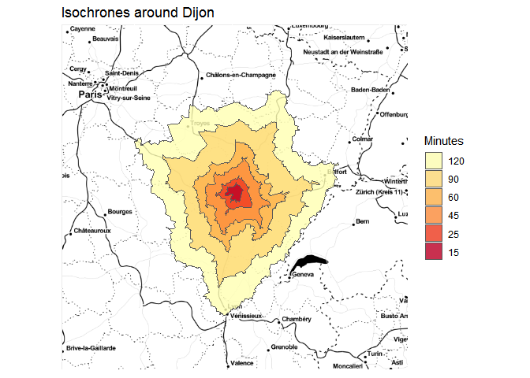
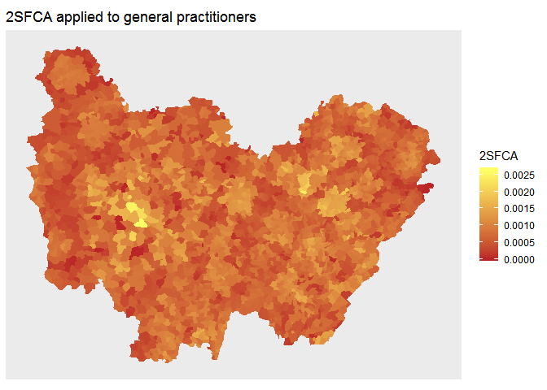

cppRouting package
================
Vincent LARMET
30 mai 2019

Package presentation
====================

`cppRouting` is a `R` package which provide functions to calculate distances, shortest paths and isochrones/isodistances on weighted graphs. Under the hood, `cppRouting` call Dijkstra and A\* algorithms implemented in C++ using std::priority\_queue from the Standard Template Library.
This package have been made with `Rcpp` and `RcppParallel`.

Install from github
===================

``` r
library(devtools)
devtools::install_github("vlarmet/cppRouting")
```

Data
====

The data presented here is the official french road network describing over 500000 km of roads.
All data used in this README are free and can be downloaded here :

-   roads : <http://professionnels.ign.fr/route500>
-   general practitioners location : <https://www.insee.fr/fr/statistiques/3568614?sommaire=3568656#consulter>
-   maternity wards location : <https://www.insee.fr/fr/statistiques/3568611?sommaire=3568656#dictionnaire>
-   shapefile of the ~36000 communes in France : <http://professionnels.ign.fr/adminexpress>

Graph data have been preprocessed for more readability (see data\_preparation.R).

The final graph is composed of 234615 nodes and 685118 edges.
Data has to be a 3 columns data.frame or matrix containing from, to and a cost/distance column. Here the cost is the time needed to travel in each edges (in minutes). From and to are vertices IDs (character or numeric).

Main functions
==============

`cppRouting` package provide these functions :
- distance matrix (between all combinations origin-destination nodes),
- distances between origin and destination by pair,
- shortest paths between origin and destination by pair,
- shortest paths between all origin nodes and all destination nodes,
- Isochrones/isodistances with one or multiple breaks.

The choice between Dijkstra and A\* algorithm is available for `get_distance_pair` and `get_path_pair`. In these functions, Dijkstra algorithm is stopped when the destination node is reached.
A\* is relevant if geographic coordinates of all nodes are provided. Note that coordinates should be expressed in a projection system.
To be accurate and efficient, `A*` algorithm should use an admissible heuristic function (here the Euclidean distance), e.g cost and heuristic function must be expressed in the same unit.
In `cppRouting`, heuristic function `h` is defined such that : h(xi,yi,xdestination,ydestination)/k, with a constant k; so in the case where coordinates are expressed in meters and cost is expressed in time, k is the maximum speed allowed on the road.

By default, constant is 1 and is designed for graphs with cost expressed in the same unit than coordinates (e.g meters).

Examples
--------

### Prepare data

``` r
library(cppRouting)
library(dplyr)
library(sf)
library(ggplot2)
library(concaveman)
library(ggmap)
#setwd("")
#Reading french road data
roads<-read.csv("roads.csv",colClasses = c("character","character","numeric"))
#Shapefile data of communes
com<-read_sf("com_simplified_geom.shp")
#Correspondance file between communes and nodes in the graph
ndcom<-read.csv("node_commune.csv",colClasses = c("character","character","numeric"))
#General practitioners locations
med<-read.csv("doctor.csv",colClasses = c("character","numeric","character","numeric"))
#Import nodes coordinates (projected in EPSG : 2154)
coord<-read.csv("coordinates.csv",colClasses = c("character","numeric","numeric"))
#Head of road network data
head(roads)
```

    ##   from     to    weight
    ## 1    0 224073 0.4028571
    ## 2    1  65036 3.5280000
    ## 3    2 173723 1.8480000
    ## 4    3      2 2.5440000
    ## 5    4 113129 4.9680000
    ## 6    5      4 1.6680000

#### Head of coordinates data

``` r
head(coord)
```

    ##   ID        X       Y
    ## 1  0 805442.8 6458384
    ## 2  1 552065.9 6790520
    ## 3  2 556840.2 6790475
    ## 4  3 554883.7 6790020
    ## 5  4 548345.2 6791000
    ## 6  5 547141.3 6790434

### Instantiate the graph

``` r
#Instantiate a graph with coordinates
graph<-makegraph(roads,directed = T,coords = coord)
```

### Distances by pairs between nodes

#### Using Dijkstra algorithm

``` r
#Generate 2000 random origin and destination nodes
origin<-sample(roads$from,2000)
destination<-sample(roads$from,2000)

#Benchmarks single core
#Dijkstra 
system.time(
pair_dijkstra<-get_distance_pair(graph,origin,destination)
)
```

    ## Running Dijkstra ...

    ##    user  system elapsed 
    ##   60.49    0.77   61.84

``` r
#Benchmarks parallel
#Dijkstra
system.time(
pair_dijkstra_par<-get_distance_pair(graph,origin,destination,allcores = TRUE)
)
```

    ## Running Dijkstra ...

    ##    user  system elapsed 
    ##   77.55    1.54   20.98

#### Using A\* algorithm

Coordinates are defined in meters and max speed is 110km/h; so for the heuristic function to be admissible, the constant equal 110/0.06 :

``` r
#A* single node
system.time(
pair_astar<-get_distance_pair(graph,origin,destination,algorithm = "A*",constant = 110/0.06)
)
```

    ## Running A* ...

    ##    user  system elapsed 
    ##   32.99    2.03   35.32

``` r
#A* parallel
system.time(
pair_astar_par<-get_distance_pair(graph,origin,destination,algorithm = "A*",constant = 110/0.06,allcores = TRUE)
)
```

    ## Running A* ...

    ##    user  system elapsed 
    ##   47.74    4.79   13.98

#### Output

``` r
head(cbind(pair_dijkstra,pair_astar,pair_dijkstra_par,pair_astar_par))
```

    ##      pair_dijkstra pair_astar pair_dijkstra_par pair_astar_par
    ## [1,]      427.5181   427.5181          427.5181       427.5181
    ## [2,]      175.5770   175.5770          175.5770       175.5770
    ## [3,]      383.0222   383.0222          383.0222       383.0222
    ## [4,]      240.5373   240.5373          240.5373       240.5373
    ## [5,]      114.4894   114.4894          114.4894       114.4894
    ## [6,]      382.0717   382.0717          382.0717       382.0717

### Compute isochrones

Let's compute isochrones around Dijon city

``` r
#Compute isochrones
iso<-get_isochrone(graph,from = "205793",lim = c(15,25,45,60,90,120))
#Convert nodes to concave polygons with concaveman package
poly<-lapply(iso[[1]],function(x){
  x<-data.frame(noeuds=x,stringsAsFactors = F)
  x<-left_join(x,coord,by=c("noeuds"="ID"))
  return(concaveman(summarise(st_as_sf(x,coords=c("X","Y"),crs=2154))))
})

poly<-do.call(rbind,poly)
poly$time<-as.factor(names(iso[[1]]))
#Multipolygon
poly2<-st_cast(poly,"MULTIPOLYGON")
poly2$time<-reorder(poly2$time,c(120,90,60,45,25,15))
#Reproject for plotting
poly2<-st_transform(poly2,"+proj=longlat +ellps=WGS84 +datum=WGS84 +no_defs")
#Import map backgroung
dijon=get_map(location=c(lon=5.041140,lat=47.323025),zoom=7, source="google",maptype = "toner-2010")
#Plot the map
p<-ggmap(dijon)+
  geom_sf(data=poly2,aes(fill=time),alpha=.8,inherit.aes = FALSE)+
  scale_fill_brewer(palette = "YlOrRd")+
  labs(fill="Minutes")+
  ggtitle("Isochrones around Dijon")+
  theme(axis.text.x = element_blank(),
        axis.text.y = element_blank(),
        axis.ticks = element_blank(),
        axis.title.y=element_blank(),axis.title.x=element_blank())
p
```



Applications
============

Application 1 : Calculate Two Step Floating Catchment Areas (2SFCA) of general practitioners in France
------------------------------------------------------------------------------------------------------

2SFCA method is explained here : <https://en.wikipedia.org/wiki/Two-step_floating_catchment_area_method>

### First step

Isochrones are calculated with the `cppRouting` function `get_isochrone`

``` r
#Isochrone around doctor locations with time limit of 15 minutes
iso<-get_isochrone(graph,from = ndcom[ndcom$com %in% med$CODGEO,"id_noeud"],lim = 15)
#Convert list to long data frame
df<-stack(setNames(iso, seq_along(iso)))
df$ind<-rep(names(iso),times=sapply(iso,length))
df<-df[df$values %in% ndcom$id_noeud,]
#Joining and summing population located in each isochrone
df<-left_join(df,ndcom[,c("id_noeud","POPULATION")],by=c("values"="id_noeud"))
df<-df %>% group_by(ind) %>%
  summarise(pop=sum(POPULATION))
#Joining number of doctors 
df<-left_join(df,med[,c("id_noeud","NB_D201")],by=c("ind"="id_noeud"))
#Calculate ratios
df$ratio<-df$NB_D201/df$pop
```

### Second step

``` r
#Isochrone around each commune with time limit of 15 minutes (few seconds to compute)
iso2<-get_isochrone(graph,from=ndcom$id_noeud,lim = 15)
#Convert list to long data frame
df2<-stack(setNames(iso2, seq_along(iso2)))
df2$ind<-rep(names(iso2),times=sapply(iso2,length))
#Joining and summing ratios calculated in first step
df2<-left_join(df2,df[,c("ind","ratio")],by=c("values"="ind"))
df2<-df2 %>% group_by(ind) %>%
  summarise(sfca=sum(ratio,na.rm=T))
```

### Plot the map for Bourgogne-Franche-Comte region

``` r
#Joining commune IDs to nodes
df2<-left_join(df2,ndcom[,c("id_noeud","com")],by=c("ind"="id_noeud"))
#Joining 2SFCA to shapefile
com<-left_join(com,df2[,c("com","sfca")],by=c("INSEE_COM"="com"))
#Plot for one region
p<-ggplot()+
  geom_sf(data=com[com$NOM_REG=="BOURGOGNE-FRANCHE-COMTE",],aes(fill=sfca),colour=NA)+
  coord_sf(datum=NA)+
  scale_fill_gradient(low="#BB2528",high = "#FFFF66")+
  labs(fill="2SFCA")+
  ggtitle("2SFCA applied to general practitioners")
p
```



Application 2 : Calculate the minimum travel time to the closest maternity ward in France
-----------------------------------------------------------------------------------------

``` r
#Import materinty ward locations
maternity<-read.csv("maternity.csv",colClasses = c("character","numeric"))
```

### Shortest travel time matrix

The shortest travel time is computed with the `cppRouting` function `get_distance_matrix`.
We compute travel time from all commune nodes to all maternity ward nodes (e.g ~36000\*400 distances).

``` r
#Distance matrix (around 10 minutes to compute)
dists<-get_distance_matrix(graph,
                           from=ndcom$id_noeud,
                           to=ndcom$id_noeud[ndcom$com %in% maternity$CODGEO],
                           allcores=TRUE)
#We extract each minimum travel time for all the communes
dists2<-data.frame(node=ndcom$id_noeud,mindist=apply(dists,1,min,na.rm=T))
#Joining commune IDs to nodes
dists2<-left_join(dists2,ndcom[,c("id_noeud","com")],by=c("node"="id_noeud"))
#Joining minimum travel time to the shapefile
com<-left_join(com,dists2[,c("com","mindist")],by=c("INSEE_COM"="com"))
```

Plot the map of minimum travel time in Bourgogne-Franche-Comte region
=====================================================================

``` r
p<-ggplot()+
  geom_sf(data=com[com$NOM_REG=="BOURGOGNE-FRANCHE-COMTE",],aes(fill=mindist),colour=NA)+
  coord_sf(datum=NA)+
  scale_fill_gradient(low="#009900",high="#003300")+
  labs(fill="Minutes")+
  ggtitle("Travel time to the closest maternity ward")
p
```


Benchmark with other R packages
===============================

To show the efficiency of `cppRouting`, we can make some benchmarking with the famous R package `igraph`, and the `dodgr` package which provide highly optimized heaps.

### Distance matrix : one core

``` r
library(igraph)
library(dodgr)
#Sampling 1000 random origin/destination nodes (1000000 distances to compute)
origin<-sample(unique(roads$from),1000,replace = F)
destination<-sample(unique(roads$from),1000,replace = F)
```

``` r
#igraph 
graph_igraph<-graph_from_data_frame(roads,directed = TRUE)

system.time(
  test_igraph<-distances(graph_igraph,origin,to=destination,weights = E(graph_igraph)$weight,mode="out")
)
```

    ##    user  system elapsed 
    ##   92.08    0.01   93.24

``` r
#dodgr
#Adding coordinates to data
roads2<-roads
colnames(roads2)[3]<-"dist"
roads2<-left_join(roads2,coord,by=c("from"="ID"))
colnames(roads2)[4:5]<-c("from_lon","from_lat")
roads2<-left_join(roads2,coord,by=c("to"="ID"))
colnames(roads2)[6:7]<-c("to_lon","to_lat")
colnames(roads2)[1:2]<-c("from_id","to_id")
roads2$from_id<-as.character(roads2$from_id)
roads2$to_id<-as.character(roads2$to_id)

system.time(
test_dodgr<-dodgr_dists(graph=data.frame(roads2),from=origin,to=destination,parallel=FALSE)
)
```

    ##    user  system elapsed 
    ##   90.96    0.12   92.15

``` r
#cppRouting
system.time(
test_cpp<-get_distance_matrix(graph,origin,destination,allcores = FALSE)
)
```

    ##    user  system elapsed 
    ##   62.51    0.34   63.67

#### Ouput

``` r
head(cbind(test_igraph[,1],test_dodgr[,1],test_cpp[,1]))
```

    ##            [,1]     [,2]     [,3]
    ## 65497  298.6589 298.6589 298.6589
    ## 31007  494.4791 494.4791 494.4791
    ## 90120  471.7311 471.7311 471.7311
    ## 173218 168.3926 168.3926 168.3926
    ## 133255 264.4111 264.4111 264.4111
    ## 207610 301.4288 301.4288 301.4288

### Distance matrix : parallel

``` r
#dodgr
system.time(
test_dodgr<-dodgr_dists(graph=data.frame(roads2),from=origin,to=destination,parallel=TRUE)
)
```

    ##    user  system elapsed 
    ##  129.23    1.33   34.44

``` r
#cppRouting
system.time(
test_cpp<-get_distance_matrix(graph,origin,destination,allcores = TRUE)
)
```

    ##    user  system elapsed 
    ##   80.90    0.67   20.98

Benchmark on computing shortest paths by pairs
----------------------------------------------

``` r
#Sampling 500 random origin/destination nodes 
origin<-sample(unique(roads$from),500,replace = F)
destination<-sample(unique(roads$from),500,replace = F)
#dodgr
system.time(
test_dodgr<-dodgr_paths(graph=data.frame(roads2),from=origin,to=destination,pairwise = TRUE)
)
```

    ##    user  system elapsed 
    ##  554.38   20.50  580.83

``` r
#cppRouting
system.time(
test_cpp<-get_path_pair(graph,origin,destination,algorithm = "A*",constant=110/0.06)
)
```

    ## Running A* ...

    ##    user  system elapsed 
    ##    8.44    0.01    8.49

### Test similarity of the first travel

``` r
#Number of nodes
length(test_dodgr[[1]][[1]])
```

    ## [1] 196

``` r
length(test_cpp[[1]])
```

    ## [1] 196

``` r
#Setdiff 
setdiff(test_dodgr[[1]][[1]],test_cpp[[1]])
```

    ## character(0)

New functions `cppRouting` will provide in the future
=====================================================

-   Detours admitting shortest paths : finding the nodes that are reachable under a fixed detour time around the shortest path
-   Graph simplification by removing irrelevant nodes in order to compute in a faster way the shortest distance or travel time
-   Contraction hierarchies implementation
